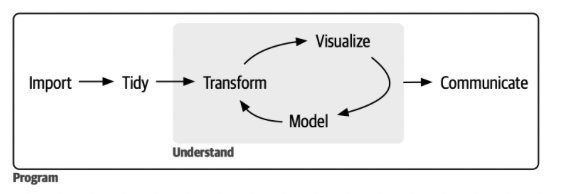
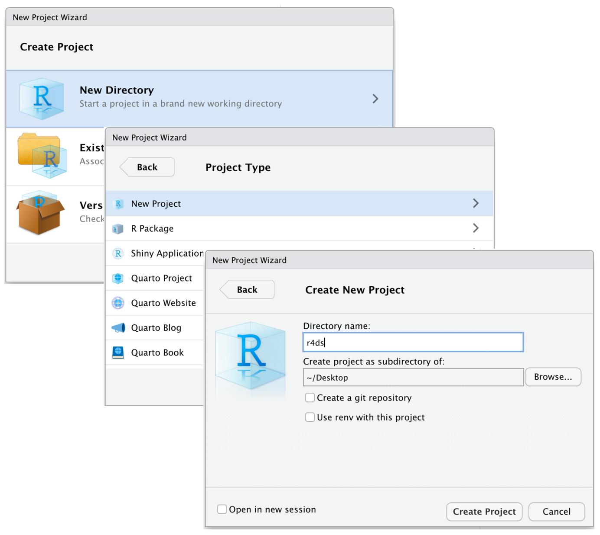
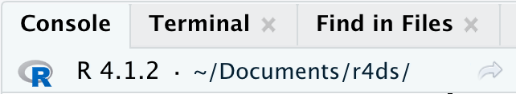

```{css, echo=FALSE}
/* Increase overall body font size */
body {
  font-size: 18px;   /* default ~16px → +2 sizes */
  line-height: 1.6;
}

/* Headings */
h1 {
  color: #F28E7B;
  font-weight: 700;
  font-size: 2.4em;
}

h2 {
  color: #88B99B;
  font-weight: 600;
  font-size: 2.0em;
}

h3 {
  color: #D18C74;
  font-weight: 500;
  font-size: 1.6em;
}

h1, h2, h3 {
  margin-top: 1.2em;
  margin-bottom: 0.6em;
}

/* Optional: make code slightly larger for students */
pre, code {
  font-size: 0.95em;
}

```

# Introduction to R: Week 1

> Welcome to the R component of **PY1617 Employability: Foundations of R for Statistics and Data Science**

This notebook brings together all material for the R component of the module, spanning ten weeks of teaching.

In this first week, the focus is on **orientation**: understanding what R is, why we are using it, how it fits into data science and statistics and getting everything set up correctly on your computer.

---

## Overview of the R Component

This component runs across **ten teaching weeks**, starting from the very basics of using R and progressing to writing functions and simulating data by the end of the term.

Teaching is shared across the module:

  1) **Weeks 1–5** are taught by Dr Abigail Page and focus on foundational R skills, data handling, and visualisation
  2) **Weeks 7–10** are taught by Dr James Winters and focus on programming concepts and simulation

By the end of the component, you will be able to use R confidently as a tool for working with data in academic, research and workplace contexts.

---

## Aims of the Component

The R component aims to develop **foundational skills in R** that underpin data analysis, statistics and data science.

Specifically, the component aims to:
  1) Build confidence in using R and RStudio
  2) Develop good habits for writing clear, reproducible code
  3) Introduce core data workflows used in statistics and research
  4) Prepare you for later statistics modules in Years 1 and 2
  5) Develop digital and data literacy skills valued in the workplace

---

## Learning Objectives

By the end of this component, you should be able to:

  1) Use **R and RStudio** confidently, including scripts, projects and packages  
  2) Understand and work with **data types, objects and data frames** in R  
  3) Apply a **tidy data workflow** to clean, transform and reshape data  
  4) Create and label **new and recoded variables**  
  5) **Summarise and visualise data** effectively using ggplot2  
  6) Use basic **programming concepts** (loops and functions) to automate tasks  
  7) Write **clear, reproducible code** suitable for academic and workplace contexts  
  8) Use these skills to **simulate data**

---

## What Is Data Science?

Data science is the process of turning data into understanding and insight.

This typically includes:

  1) Managing data  
  2) Cleaning and preparing data  
  3) Exploring and visualising data  
  4) Modelling and interpreting results  
  5) Communicating findings clearly  

Data science is best thought of as a **workflow**, rather than a single technique.

### The data science workflow

Throughout this module, we will refer to the **data science cycle (Figure 1.1)**, which describes how data are:

  1) Imported: bringing data into R   
  2) Prepared and transformed: cleaning the data so you can do what you want with it.   
  3) Explored and visualised: explore patterns and trends   
  4) Modelled: apply statistical models   
  4) Communicated: report your results clearly in plots and tables   



We can think of this as a cycle because you don't do the steps only once, but you loop back and forth. 

The first step in any data analysis is importing your data into R. This usually involves loading data from a file into a data frame. Without access to your data within R, you cannot perform any analysis.
Once your data is imported, it’s important to tidy it. Tidy data has a consistent structure where each column represents a variable and each row represents an observation and each cell represents a value (Figure 1.2). This organization makes it easier to work with the data, allowing you to focus on analysis rather than data cleanup.


After tidying, the next step is often transforming your data. Transformations can include filtering for specific observations (e.g., data from a particular participant or year), creating new variables from existing ones (e.g., calculating speed from distance and time), or computing summary statistics (e.g., counts, averages). The process of tidying and transforming data is commonly called data wrangling, because getting data into a usable form can be challenging.

With clean and well-structured data, you can begin generating insights through visualisation and modelling. These approaches complement each other:

  - Visualisation is a human-centred activity. Well-designed visualisations can reveal unexpected patterns, suggest new questions or indicate that you may need additional data. While visualisations are invaluable for understanding, they rely on human interpretation and don’t scale easily to large datasets.

  - Modelling provides a computational approach. Once your questions are clearly defined, models can answer them efficiently and at scale. However, models operate under assumptions and cannot challenge those assumptions on their own. They are powerful, but inherently limited in their ability to surprise. 
  
Finally, communication is essential. The insights you derive from analysis - whether through visualisations, models or summaries — are only useful if you can clearly explain them to others.

Throughout the process, programming supports every step. While you don’t need to be a programming expert, stronger programming skills allow you to automate tasks, work more efficiently and tackle new problems more effectively.
These tools cover most of what you’ll need in a data science project. 

This R component focuses primarily on the **foundational stages of this cycle: importing, tidying and visualising data**. These are the skills that everything else depends on.
Data modelling and communication will be focused on in other components and modules. 

---

## What Is R?

R is a programming language designed specifically for **data analysis, statistics and graphics**.  
It was first developed in 1996 and is now widely used in academia, research and industry.

R is:

  - A command-driven language
  - Highly flexible and extensible
  - Widely used for statistical analysis and data visualisation

You may have encountered other statistical software such as SPSS, Stata, or MATLAB. R differs from these in that it is:

  - Script-based rather than menu-driven (you write things rather than click things)
  - Highly customisable
  - Open source and free to use

---

## What Is RStudio?

RStudio is the software environment we will use to work with R.

You can think of:

  - R as the engine which does the work   
  - RStudio as the dashboard which makes it easy to do the work   

RStudio provides:

  - A script editor
  - A console for running code
  - Tools for viewing data, plots and files
  - Integrated help and documentation

Once we have installed RStudio we no longer need to directly access R! 

### Why we use R & RStudio

R & RStudio is widely used because:

  - Faster & more accurate than hand calculations: Computers handle repetitive statistical tasks easily. Doing a few calculations by hand helps you understand concepts, but mostly it’s about intuition.
  - Better than spreadsheets: Excel and similar tools feel familiar but are limited for serious analysis. R is far more flexible and powerful.
  - Free & open source: No expensive licenses, no student-version traps—R is professional-level software at no cost.
  - Highly extensible: Thousands of additional packages are freely available, letting you use cutting-edge methods and advanced techniques as you grow.
  - Learn programming along the way: Using R teaches programming skills, which are essential for modern research, online experiments, automated data collection, AI, and computational methods.
  - Widely used in research: Learning R gives you access to standard tools in statistics and psychology, putting you closer to advanced, real-world methods.

Bottom line: R can be challenging at first, but its power, flexibility, and relevance make it the best choice for serious data analysis.

---

## Challenges of Learning R

Learning R can feel challenging at first, especially if you do not have a programming background.

Common difficulties include:

  - A steep initial learning curve
  - Small errors in code causing unexpected problems (e.g. a missing closing bracket or misplaced comma can be frustrating)
  - Not knowing how to phrase questions when searching for help

This is normal.

> **A useful rule of thumb:**  
> Knowing what to search for is a large part of working effectively in R. AI tools make this a lot easier!


Over time, you will build familiarity with common patterns and solutions.

---

## Installing R and RStudio

Before you can start using R, you need to install **both R and RStudio**.

### Installing R

1. Go to: https://cran.r-project.org  
2. Select your operating system (Windows, macOS, or Linux)  
3. Download and install the **latest version** of R  

> Always install R **before** installing RStudio.

---

### Installing RStudio

1. Go to: https://www.rstudio.com/products/rstudio/download/  
2. Download **RStudio Desktop (free version)**  
3. Install the latest version for your operating system  

Once installed, you will **open RStudio**, not R itself.  

Opening RStudio automatically starts R in the background.

Finally You will need to download Rtools from Cran: https://cran.r-project.org/bin/windows/Rtools/. 
Make sure this is installed before moving on. 

---

## First Steps in RStudio

When you open RStudio for the first time, you will see several **panes** (also called panels). Each has a different purpose to help you work efficiently in R.

- The **console** (where code runs) on the left 
- The **environment** (where objects are stored) on the top right 
- Panels for plots, files, and help on the bottom right 

### Console
The **console** is where you **type and run R commands directly**.  We will play around with this at the end of the session. 
The console executes your commands immediately and shows the results.

### Envrionment and history 
The Environment tab shows all the objects you have loaded into R or created (variables, data frames, lists, etc).
The History tab keeps a record of all the commands you have run in the console. You can click on it and see what you have just done, and re-run it. 

### Files, plots, packages, helps and viewer 

This is were you can view lots of useful pieces of information and access your files: 

  1) Files: Lets you browse files in your project folder. You can import data from here. 
  2) Plots: Displays graphs and visualisations you create. This pops up automatically when you make a plot. 
  3) Packages: Displays which R packages are installed and loaded. What you can use to install more packages (we will get to this)
  4) Help: Shows documentation for functions you search.
  5) Viewer: Used for HTML outputs and interactive visualisations.

These tabs help you navigate your project, visualize results and find help quickly. We will come to each of these sections in turn. 

First, there is a final section of RStudio which is only viable when you open up a R Script. 

### R scripts 

An R script is a file where you can write, save and edit multiple lines of R code. Like a word document for R code! 
Scripts have the file extension .R and are saved in a folder on your computer. 

You can either open a blank script: 
  - Go to File (top left piece of paper with a green plus) 
  - New File 
  - R Script

This creates a script where you can write and save your code.

OR you can load a pre-made R script which you or someone else have made to run. You can download the pre-made R Script for Week 1 session here:  

[Download the R Script](https://brightspace.brunel.ac.uk/d2l/le/lessons/67180/topics/2028425)


---

## Basic R Expressions 

You can:

  - Type directly into the **console**, or  
  - Write code in a **script**, which can be **saved, shared and reproduced**.  

> Tip: If you write directly in the console, your work is **not saved** when RStudio closes. 

So while we will show you how to write script directly into the console today, in future we will be working with scripts. 

### Writing in the console

In R, `<-` is the **assignment operator** (not `=`).  

  - Example: `x <- 500` tells R “x equals 500.”  
  - Whenever you type `x`, R will read it as 500.  

**Steps:**

  1) In the console (after the `>`), type:  
  2) "x <- 500" 
  3) press enter 
  4) write x in the next line 
  5) press enter 

it will look like this: 

```{r}
x <- 500 
x

```

> **Question**: when you select "x" what is the output? 

> **Activity**: practice with different numbers and letters

In the top right corner of the console you will see a **brush** icon. If you click on it, it clears your console environment. Do this now. 

You now have a blank screen so have lost your work. If you go to the history tab now you can see your previous code, and doubling clicking it will bring it back to the Console for you to re-run! 

But because you cannot save your work in the console we recommend you always write code in an R script. 

### Writing in a script 

Lines starting with `#` are **comments**.  These are notes you leave for yourself or others to help understand what it is you have done

  - R **ignores them**, so they are not run.  
  - They can say anything you like
  - They are essential - you will thank yourself later for a well commented script! 
  
Below is what working in a script looks like.  

```{r}
# THIS IS A COMMENT! 

# To run the code below just select the lines and press 'run' above 
#(or control/command + enter). You can run line by line, or select it all at once.

x <- 10 # telling R that x now equals 10  
print (x) # printing this in the console

# so this has done the same as above, but now your work is saved here. 

y <- 10 + 20 # telling R that y now equals 10 + 20
print (y)  # printing this in the console 

z <- "hello" # telling R that z now equals "hello"
print(z) # printing this in the console

# you can also get R to print by highlighting the text and press 
# enter/run (called auto-printing) which is often easier to do!

a <- "hello"
b<- "world"
a 
b   # run all four lines at once 
```

## Working with R: Key things to know

Some final points about R’s behaviour, errors, spacing and “unfinished commands”

### R is literal
R does exactly what you tell it. It has no intuition, no autocorrect and no ability to guess your intent.
Typos matter. For example 10 = 20 gives you an error 
  
```{r}
10 - 20   # produces -10, but may not be what you meant

```
Even simple mistakes can produce wrong answers without errors. Always double-check what you type.  
    
### R ignores some spacing
Extra spacing usually doesn't matter 
  
```{r}
10 + 20
10+20    # both work fine

```
  
  - but don't split words or function names (e.g. you can't say citat ion())
  - consistent formatting is good practice 

### R can comestimes detect incomplete commands
  - If R thinks a command isn't finished, it waits for more input 
  - This also works works for long commands broken over multiple lines 
  - To cancel a command mid-typing, press escape to return to the prompt. 
  
R is a powerful tool, but it’s precise and literal. Be careful with typos, spacing, and parentheses, and remember that errors are part of learning. With practice, reading and understanding R’s responses becomes easier.

# Workflow in R: Week 2 

This week focuses on good workflow habits when working with R. These skills may feel minor now, but they are essential for reproducible analysis, collaboration and avoiding frustration later in the course.

> **Using this notebook**: In the lecture you will workthrough this notebook. You should copy the code segments below into a new R script (instructions given below) to practice and work through the exercises and questions.  

## Organising folders on your computer

Before opening RStudio, it is important to think about how your files are organised on your computer. Much confusion and many errors in data analysis come from poorly organised files rather than problems with the code itself.

Some guidance on best practice: 

  - Create a main course folder (e.g. PY1617) and keep all related work inside it
  - Inside this folder, create sub-folders for different types of files, such as:
    - `data` – raw and cleaned data files
    - `scripts` – R scripts you write
    - `outputs` – plots, tables or processed data created by R
  - Use clear, informative names that describe what the file contains
  - Avoid spaces and special characters; use hyphens - or underscores _

Good organisation makes it easier to:

  - Find files quickly
  - Understand your work weeks or months later
  - Share work with others
  - Avoid breaking code that relies on file paths

> **Exercise 2.1** 
Create a folder structure for this module on your computer. 

> Call the first folder "PY1719", with sub-folders for "analysis", "methods" and "skills". In the **skills folder** include the following folders: 
  1)	Data
  2)	Scripts 
  3)	Outputs 


## Object based computing

R is an **object-based programming language**. This means that most of what you do in R involves **creating objects** and then **doing things to those objects**. It is useful to remember that everything in R is an object.

An **object** is simply a way of storing information so that R can use it later.

### What is an object?

An object can store:

  - A single number  
  - Text (a character string, e.g. "Hello")  
  - A collection of values  (e.g. 1, 5, 7, 3)
  - An entire dataset  (rows and columns)

For example, last week we learnt how to store a single number within the 'x' object

```{r}
x <- 10

x
```

Here:

  - x is the object name
  - <- assigns a value
  - 10 is the value stored inside the object

Once an object is created, you can reuse it:

```{r}
x + 5
```

R remembers what x refers to and uses its stored value to add 5 to 10 = 15 

### Why use objects?

Objects allow you to:

  - Avoid repeating the same values
  - Work with complex data (such as datasets)
  - Write clearer, more readable code
  - Build analyses step by step

For example, instead of repeatedly typing a dataset name or value, you store it once and refer to it when needed.

### Object Names

Object names should be:

  - Short but meaningful
  - Written in lowercase (as a rule you don't want to be messing around with caps in your code)
  - Use underscores rather than spaces

Examples of good names:

  - `age`
  - `survey_data`
  - `mean_score`

Examples to avoid:

  - `x1` (often the default at importing, so quickly confusing)
  - `my stuff` (too genric)
  - `FINALdata` (you will end up with finalfinalFINALdata which is confusing)

Good naming makes your code easier to understand and reduces mistakes.

### Reusing objects 

Once an object exists, it can be:
  
  - Used in calculations
  - Passed into functions
  - Combined with other objects

```{r}
y <- x * 2 # Here, y is created multiplying the value stored in x by 2
y
```

> Object-based thinking is central to working effectively in R: create objects, then operate on them.

### Activity 2.1: Working with objects 

This activity will help you practise creating and using **objects** in R.  

Step 1: make a new script in R. Select the paper icon with a green plus on it in the top-left corner and select 'R Script' from the top of the drop-down menu.  

Step 2: create the following objects by copying this code into your script

```{r}
age <- 20
years <- 5
name <- "Alex"
score <- 68

```

> **Question 2.1**: Check that these objects appear in the Environment pane. Can you see the correct values attributed to the objects? 

Step 3: Create a new object using the objects you already mad 

```{r}
age_next_year <- age + 1


```

> **Question 2.2**: What is Alex's age after five years? 

Step 4: R allows you to overwrite objects, so update the age variable 

```{r}
age <- 25

```

> **Question 2.3**: what happened to the original value of age? 

**Be careful: once an object is overwritten, the old value is lost unless you saved it elsewhere.** 

Step 5: make a simple single observation dataset to add to your environment 

Firstly, check that all your objects already made appear in your environment pane (name, age, years and score) 

Now combine these objects into a dataset with one row:

```{r}
student <- data.frame(
  name = name,
  age = age,
  score = score
)

```

You have created a dataset with one observation! 

> **Reflection**
1) Which objects currently exist in your Environment?
2) What happens if you restart RStudio and type age again?
3) Why does this show the importance of scripts?


## Understanding the R environment 

When you work in R, everything you create or load during a session lives in the R environment. **The environment is R’s internal workspace, where objects such as data files, variables are stored and easy to access**. This becomes very useful the more complicated your analysis. 

### What lives in the environment?

- Data you read in from files (e.g. CSVs)
- Variables you create (numbers, text, data frames)
- Objects created by running code in scripts or the console (like we just did) 

For example:

```{r}
x <- 10 
y <- 100 
```


Both x and y are now alongside your ‘student’ data and other objects now exist in the environment and can be used by other lines of code.

You can check what objects are in your environment with the `objects()` function 


```{r}
objects()
```


You can remove objects from your environment as well as adding them. In RStudio, the easiest way to remove variables is using the Environment pane.

  - click the brush at the middle of the envionrment pane 
  - This removes all the objects in your environment, resetting it. 
  
**Deleting variables cannot be undone.** Once a variable is removed, it no longer exists in the environment.
You can also remove variables using code, which is useful if you want to be explicit in a script.

```{r}
rm(x, y)
objects() # re-run the check on objects to confirm they are gone. 
```


### The Environment pane

The Environment pane shows:

  - A list of all current objects
  - Their names and basic information (e.g. size or type)

This pane helps you:

- Check whether your data has loaded correctly
- See what objects are available to use
- Avoid re creating objects unnecessarily

*If something is not in the Environment, R cannot use it.*

### Sessions and memory

  - The environment only exists while RStudio is open
  - When you close RStudio, the environment is cleared
  - This is why saving scripts is essential: scripts allow you to recreate the environment by rerunning code
  - We can also avoid this by using projects…
  
## RStudio projects 

An RStudio Project connects RStudio to a specific folder on your computer. Keeping all the files associated with a given project (input data, R scripts, analytical results and figures) together in one directory is such a and common practice that RStudio has built-in support for this via projects. 

### Why use projects?
  
  - Automatically sets the correct working directory
  - Keeps scripts, data, and outputs together
  - Makes it easier to return to your work later

### Activity 2.2: Creating a project for this component 

We are now going to make use of your folder structure you made earlier to save our R project in an easy to find location. Please follow these steps: 

  1.	Open RStudio
  2.	File → New Project → Existing Directory
  3.	Select your skills component folder you made earlier 
  4.	Call your project ‘foundations’ 




**Now, quit RStudio**. Inspect the folder associated with your project — notice the `.Rproj` file. Double-click that file to re-open the project. Notice you get back to where you left off: it’s the same working directory and command history, and all the files you were working on are still open. 

## Working directory 

Once you have made your project you will have a ‘home’ to save all your code and output. This is called the working directory is the folder R looks in straight when reading or saving files. This is like in your computer when you first go to save a word document it first suggests ‘your documents’ folder. 

Basically, now **R will default to save everything, and import everything from your project folder you just made!** This is super useful to be easily able to find your work. 

### Checking your working directory

RStudio shows your current working directory at the top of the console:




And you can print this out in R code by running `getwd()`

```{r}
getwd()

```


If you want to know the associated list of files and/or sub-directories within your working directory you can use `dir()`

```{r}
dir() 
```


## Saving scripts and naming files 

**RStudio automatically saves the contents of the script editor when you quit, and automatically reloads it when you re-open**. Nevertheless, it’s a good idea to avoid `Untitled1`,`Untitled2`, `Untitled3`, and so on and instead save your scripts and to give them informative names.

Script files are those with a `.R` file extension. These aren’t data files at all; rather, they’re used to save a collection of commands that you want R to execute later.

It might be tempting to name your files `code.R` or `myscript.R`, but you should think a bit harder before choosing a name for your file. Three important principles for file naming are as follows:

Good file names should:

  - Be machine readable: avoid spaces, punctuation, and special characters
  - Be human readable: the name should describe what the file does or contains
  - Sort in a sensible order: numbering files (e.g. 01-, 02-) helps keep work organised

For example, instead of:

  - `code.R`
  - `final.R`
  - `temp.R`

Prefer:

  - `01-load-data.R`
  - `02-exploratory-analysis.R`
  - `03-clean-data.R`

Clear file names reduce confusion and help others (and your future self) understand your workflow.

> **Exercise 2.2**: At the moment you should have a unamed script you have been using for this weeks content. Please now give it a sensible name (e.g. week2) when you save it. You can save it by pressing the disk icon in the script 
pane in the top left. This will automatically open up the interface to your working directory. 

## Reading and writing files using relative paths

Once you are working inside an RStudio Project, you should always use relative paths, not absolute paths.

*A relative path is written relative to the project’s working directory*. For example: `data/diamonds.csv`

This is telling R to access the data file (.csv) diamonds in the ‘data’ folder which is saved in your R project folder (set by your working directory).

This works on any computer, as long as the file is inside the project folder. This makes your code portable and easy to share (doesn’t have the long file directory with your user name etc. which won’t work on other computers) 

An absolute path points to a specific location on one computer, such as:

  - Windows: C:/Users/...
  - Mac/Linux: /Users/...

*You should avoid absolute paths in scripts* because no one else will have the same folder structure. This shows you why its so important to have a good folder structure at the start of any project. 

One final detail:

- Windows uses backslashes (\) in file paths
- Mac and Linux use forward slashes (/)

R can handle both, but backslashes need special treatment and can cause errors. For this reason, always use forward slashes (/) in R, even on Windows.

### Reading in datasets 

So now we know all this we can import data from our data sub-folder into R easily. Comma separated value (CSV) files are those with a `.csv` file extension. These are just regular old text files, and they can be opened with almost any software. It’s quite typical for people to store data in CSV files, precisely because they’re so simple.

We will be using CSV files in this component as a rule. 

```{r}

mydata <- read.csv("data/mydata.csv") 

# you are telling r what to call the  # dataset (mydata) and you are telling R 
# where to find the data (in the data folder, called my_data.csv) 

```

We can also ask R for some specifics when we are reading in our data. These specific requests are called 'arguments' in R terminology: 

  - The argument `header` is a logical variable indicating whether variable names are included in the top of each column or not.


```{r}

mydata <- read.csv("data/mydata.csv", header = TRUE)

```

We inspect the data using the function `head()` which presents the first 6 rows of the dataset.

```{r}

head(mydata) # it's a single variable of height 


```

### Writing data 

'Writing' data refers to when we want to export data from R on to our computer. You could otherwise call it saving, like you would in excel. The standard function in R to export data is `write.csv()`. Let's try this with a new dataset. We will now use one of the built in data-sets that R has, called 'iris'. 

R has a couple of in-built learning datasets, so we are just going to save this to your computer. We are going to use the relative path so we're sending it to the outputs folder within your working directory. This just means you know where to find it. 

```{r}

write.csv(iris, "outputs/iris.csv") 

# here we're saying, find the file called 
# 'iris' then write it to csv. in the outputs folder within the working 
# directory. Go check this folder now to confirm. 

```

> **Exercise 2.3**: bring together all your skills now and make a dataset with the following objects 1) your name, 2) your age, 3) your fav colour and 4) your height. The save this as "mydf.csv" in your outputs folder. Then go to this folder and open it in excel. 

## Functions and Arguments

Just before we wrap up this week we are going to introduce formally a last few key things in R: functions, arguments and packages. 

R works by creating objects, applying functions to objects to make them doing specific things and controlling behaviour using arguments.

### Functions

Functions perform actions on objects. We saw this actually just above with the `read.csv()` which is the function, and the argument of `header=TRUE`. To give another example using the data we just read into R. 

```{r}
# the mydata is just one variable - 'height' so lets compute the mean for this 

mean(mydata$height) 

# we will learn more about dataframes next week, but the 
# way I have called the object has changed slightly to mydata$height 
# this is because height is a variable within the dataset, so i'm asking R to 
# look into the object dataset [mydata] to find the object variable [height]
# but we will come back to this

```

This function here is `mean()` and it calculates the average of the values stored in x. Rather than calculating the sum of your numbers and dividing manually every time, you can use the mean function, which performs this calculation for you with a single command. This makes your work easier and more efficient. Later in the module, you’ll learn how to write your own functions to perform custom calculations automatically. 

However, here the function to compute the 'mean' hasn't worked because it has returned the result `NA`. This is because R cannot compute a mean if there are NAs in the dataset (which there is if you look at the `mydata` tab in the viewer) and you haven't told R how to handle these NAs. You need an **argument** to do this. 

### Arguments

After the functions comes the **arguments** - the content of the brackets. Arguments change how a function behaves:


```{r}

mean(mydata$height, na.rm = TRUE) 

# na.rm means 'remove NAs' so your telling R
# just to compute the mean igroning the NAs. 

```

So here: 

  - `mydata$height` is the object
  - `mean()` is the function
  - `na.rm = TRUE` is an argument telling R how to handle missing values (telling R to remove all missing values when you are calculating the mean)
  
Understanding this pattern — **objects → functions → arguments** — is key to reading and writing R code.

## Packages

A package is basically just a big collection of functions, data sets and other R objects that are all grouped together under a common name. Some packages are already installed when you put R on your computer, but the vast majority of them of R packages are out there on the internet, waiting for you to download, install and use them.

R packages are basically add-ons to base R. Base R does a number of simple functions, but thanks to the open-source ethos behind R the R community has built a large number of packages (over 14,000 on the CRAN where you downloaded R from) to solve common problems or offer new analysis techniques. This is the reason why R is so great. A package brings new functionality in the form of data, code, documentation and tests. 

Generally, when you open up R, only a few of these packages (about 7 or 8) are actually loaded. Basically what it boils down to is this:

  - **A package must be installed before it can be loaded.**
  - **A package must be loaded before it can be used.**

### Installing packages  

**You only need to install packages once**. To so you need to use the install packages command `install.packages("tidyverse")`

This is the R command that does all the work. R then goes off to the internet, has a conversation with CRAN, downloads some stuff, and installs it on your computer. Here we are downloading the tidyverse package which has many of the functions we will be using in the coming weeks. 

### Loading packages 

Loading makes it available for use. You will need to do this every session, unless you are saving your environment. Most scripts you will see start with the required packages at the top, in addition to any required data (we will review scripts set-up in more detail next week). **It is good practice to specify which packages your project requires at the start of any script** as they are unloaded when you re-start R and chunks of code won't work if you don't re-install them (and its way too easy to forget which chunk uses which package).

```{r}
library(tidyverse)
```

The tidyverse is actually a group of core packages. You can seem them listed above. We will be making use of dplyr, ggplot2 and readr in the coming weeks. 

# Data in R: Week 3

This week builds on the workflow foundations from Week 2. We will focus on **how to write good scripts** and introduce the **core data structures** used in R. These skills are central to working efficiently, reproducibly and confidently with real data.


## R Scripts in more detail 
Before working with data, it is important to develop good coding habits. These habits will save you time, reduce errors and make your work understandable to others.

We started using a script last week but this script had no formatting. You just copied and pasted code from this notebook into it. What this means is that it can be hard to come back to the document and work out what meant what, or where you left off. We have to add structure to our script, just like we have titles and headers in a word document to make it easier to understand. 

### Structuring your script from the very top

Every script you write should **start with a clear header**. This makes it immediately obvious what the file is for and when it was last worked on.

A good script header usually includes:

  - A short title describing the purpose of the script
  - Your name and any co-authors 
  - The date (or date range) of work

```{r}
# ============================================================
# Script: week3_practice.R -----------------------------------
# Purpose: Working with scripts and data frames
# Author: Your Name
# Date: 2026-02-01
# ============================================================
```

This header does not affect how the code runs, but it is extremely valuable for organisation and reproducibility. It will always sit at the top of your script. 

### Start with packages and data

The first functional section of your script should deal with **anything that must be available before the rest of the code can run**. This usually includes:

  - R packages that need to be loaded (assuming they are installed)
  - Data files that need to be read into R

Placing these steps at the top means that:

  - Errors appear early, not halfway through your analysis
  - Anyone running your script knows exactly what they need

A typical structure looks like this:

```{r}
# ============================================================
# Script: week3_practice.R -----------------------------------
# Purpose: Working with scripts and data frames
# Author: Your Name
# Date: 2026-02-01
# ============================================================


# 1.0 Setup ------------------------------------------------------

## 1.1 Packages   ------------------------------------------------
library(tidyverse)

## 1.2 Data import ------------------------------------------------
iris_data <- iris # if working  from a pre installed dataset.   
mydata <- read.csv("data/mydata.csv") # importing from your project 

### 1.2.1 Data inspection --------------------------------------------
head(mydata)

```

Note that I have started numbering the sections, again this is just good practice for when you start having really long processing and analysis scripts to help you work out where you are. 

### Using # and ## for the RStudio document outline

RStudio provides a document outline / drop-down menu (at the bottom right of the script pane) that allows you to jump between sections of a script. This becomes increasingly useful the longer your script gets. You can click on it to quickly move between different sections - kind of like a table of contents. 

RStudio recognises comment-based headers using hashes and dashes:

```{r}
 # creates a top-level section ---------------------------------
 ## creates a subsection ---------------------------------------
 ### creates a sub-subsection ----------------------------------
```


For main section headings you use four dashes after a single #. If you use two ## or ### they become nested subheadings underneath the main heading. 

Example:

```{r}
# 2. Data import -----------------------------------------------------
## 2.1 Reading files -------------------------------------------------
### 2.1.1 Inspecting the data ----------------------------------------

```

These  headers will appear in the RStudio drop-down menu, allowing you to quickly navigate large scripts.

> Good practice: Use top-level headers (#) sparingly for major stages of your workflow, and sub-headers (##, ###) for detail.

If you use separators without text you will get untitled in the drop-down menu which helps you navigate the script quickly. 
e.g. 

```{r}
# ------------------------------------------------------------
```

RStudio sees this as a section with no name, so it shows up as “<untitled>”.

### Activity 3.1: Create a new R script for this weeks material and structure it as follows:

  - A header with title and date
  - A packages section (installing tidyverse) 
  - A data import section (importing data xxx) 
  - Add in the following structure: 

TBC..... 

We will populate this structure as we work through the rest of the workbook. As will last week, copy the code chunks into the script. 

Finally make sure you save it to a folder in your R project, with a sensible name. 

## Data types

In R, every object has a type (also called its class). The type determines what kind of values the object can store and what operations make sense.

### Common data types in R

The most frequently used data types are:
  - Character: text values, e.g. names or labels: "a", "hello"
  - Numeric: real numbers with decimals: 2.1, pi
  - Integer: whole numbers: 1, 2, 3 etc. 
  - Logical: TRUE or FALSE values
  - Factor: categorical variables with fixed levels

let's make some now: 
```{r}
char_example <- "statistics" 
num_example <- 3.14 
int_example <- 10
log_example <- TRUE
```

Now we can check what data type each of these objects are by using the ‘class’ function which calls the objects we just made in the brackets: 

```{r}
class(char_example) 
class(num_example) 
class(int_example) # telling you it’s a numeric value, which is wrong! 
class(log_example) 
```

Although numeric and integer values often behave similarly, they are stored differently in memory. Factors will be discussed in more detail later once we have covered vectors, as they are especially important for statistical modelling.

> **Exercise 3.1**: create four variables of the correct types for the following variable names: name[“Alex”], score[“72.65”], age [“30”] and passed [TRUE/FALSE]

> **Exercise 3.2**: using the class() fuction to check the data type. Are any wrong ? Comment in your script using # if any are wrong.    

### Coercion between types

You can coerce values into different types. R automatically reads an interger as numeric. So you have to tell it. You can either add an L at the end or change it’s class: 

```{r}
int_example <- 10L
int_example  <- as.integer(int_example) # note that I have used the object 
# assignment operator again here. If I didn’t R wouldn’t save your changes 

# likewise, you can coerce it back to numeric
int_example  <- as.numeric(int_example) 

```


you can do the same with factors with as.factor (but we’re coming back to this)

> **Exercise 3.3**: use as.integer() function to coerce “age” into an integer and save the result. Re-check it using class(). 
 
## Vectors

Vectors are the fundamental data structure in R. A vector stores multiple values of the same type in a single object. For instance, a numeric vector comprises of a list of numbers (e.g. [1, 2, 6, 6, 3, 6, 2] is a vector of integers) . In this section we will examine various ways to construct and subset a numeric vector. 

### Creating vectors

The simplest way to create a vector is with the c() (combine) function.

```{r}

vec1 <- c(1, 2, 3, 4, 5) 
vec2 <- c(6, 7, 8, 9, 10)
vec1 
vec2 

```


Two vectors can also be joined into the same vector using the `c()` command. The two smaller vectors will appear in the new one in the order you specify:

```{r}
vec3 <- c(vec1, vec2)
vec3 
```


### Vectors are ordered

Vectors are ordered, meaning the position of each element matters. The first element is position 1, the second is position 2, and so on. When you reference a vector by position, you get exactly the element in that position.

```{r}
my_vector <- c(10, 20, 30, 40) 
my_vector
# the second element is 20 
```


Ordering also matters for calculations and operations. For example, if you add two vectors together, R adds them element-wise based on their positions:

```{r}
v1 <- c(1, 2, 3)
v2 <- c(10, 20, 30) 
v1 + v2 

```


Changing the order of elements changes the results of any operation that relies on position.

```{r}
rev_vector <- rev(my_vector) # reverses the order - note it is saved under 
# a new object name (rev_vector) 
```

> Key takeaway: Always be aware of the order of elements in a vector. Many mistakes in data analysis happen when positions are assumed incorrectly.

> **Exercise 3.4**: Create a vector of 5 numbers representing daily sales. 

### Indexing vectors
Square brackets [] are used to extract elements from vectors. This is how we can check the ordering. 

If we want to extract the nth (e.g. 5th) element of a vector, specify n within the square brackets:

```{r}
my_vector <- c(12, 16, 1, 9, 0) 
my_vector[5] 
```

This feature can be extended to extract multiple elements from a vector. For instance if we wanted to select the first and second elements of the vector "my.vector", we would do so in the following way:

```{r}
my_vector[1:2]
```

> **Excerise 3.5**: Use indexing to find the sales for day 3. Then reverse the vector and check which sale is now in the second position. 

### Removing values 
We are also able to remove the nth element from a vector, we can do so using the '-' command within the square brackets.

```{r}

my_vector[-2]

my_vector[-c(1:2)]

```
Remember, however than you will need to re-save the vector (ideally with a different object name to avoiding overwriting). 
```{r}
my_vector # does it still include the 2nd element? 
My_vector2 <- my_vector[-2]  # what about now? 
```

### Text vectors and factors

Vectors can be also made up of `strings` (i.e. words) instead of numbers. We simply have to
enclose the characters/strings by quotation marks like in the following example:

```{r}
country <- c("Japan", "USA", "France")
country

```

In many situations, a sequence of strings masks realizations from categorical variables such as religion,
political party and blood type. This is the `character` data type. R offers an efficient way to store these sequences as `factors`. 

Factors are the last variable type in R, otherwise known as categorical, nominal or ordinal variables. These are variables which are groupings with no clear order (e.g. apple, banana, orange - two apples are not the same as one orange), or if ordinal then groupings with an order but you don't know the size of the space between the levels (e.g. 1st, 2nd and 3rd in a race. You know that the 1st person is quicker, but you don't know by how much). 

```{r}
blood <- c("A", "B", "O", "AB", "A", "B", "O", "O", "AB", "B") # make a vector of characters 
blood 
class(blood)  # check the class is 'character 
```

In the first line we made a string list the blood type of 10 observations. This doesn't necessarily make a factor, however. A factor must have levels (e.g. the groups - A, B, AB, O) specified to 'lump' together these observations (e.g. 2 observations of A, 3 obervations of 0 and 2 observations of AB) 

So, we force the vector of characters to be factor using the function `as.factor`. By doing this that R recognises that blood is made up of a limited (4) number of possible values (A, AB, B and 0) which become the levels. when you print `blood` now it tells you the observations in the first line, and the number of levels in the second.  

```{r}
blood <- as.factor(blood)
blood
```

You can also ask R to just tell you the levels using the function `levels()` and the number of levels using `nlevels()`

```{r}
levels(blood)
## [1] "A" "AB" "B" "O"
nlevels(blood)
```

Factors can also be comprised of numbers. Sometimes, in data entry, rather than write 'man', 'woman' or 'non-binary' researchers will code these observations to '1', '2' and '3'. Some people just prefer this in data process and analysis. In this case, you just need to tell R that these numbers need to be handled as a factor. 

### Activity 3.2: Making a factor. 

To make a `gender` factor please do the following steps: 

 - Make a new object called `gender` based on a vector of 15 integers 
 - The observations should be a combination of 1 for men, 2 for women and 3 for non-binary. You can pick the distribution of numbers 
 - Check it's class. Is it numeric or character? 
 - Force it to be a factor. 
 - Check it's class again. What is it now? 
 - How many levels does it have? 
 - What happens to the `gender` variable now if you try to add 2 to it (e.g. gender + 2) - why? 

Following this exercise, you will notice really quick that how easy it will be to forget what 1, 2 and 3 mean. You come back to this analysis in 6 months and I promise you, you won't remember who was a man and who was a woman. So we are going to want to change the labels of the levels (e.g. what we call the levels)

What we need to do is assign meaningful labels to the different levels of each factor. Here I'm giving an example of different treatment groups is a de-stress study. Group 1 is mindfulness treatment, group 2 is relaxation and group 3 is CBT therapy. 

Note, that this time, while I'm using integers to denote the groups, I have used the " " on either side of them. This means that R automatically reads them in as 'characters'. You can check this with the `class` function. But we will still need to tell R it's a factor to get the levels: 

```{r}

participantgroup <- c("1", "1", "1", "1", "2", "2", "2", "2", "3", "3", "3", "3")
class(participantgroup) 
participantgroup <- as.factor(participantgroup) 
levels(participantgroup) # 1, 2, 3 

# So lets re-name the levels to something we will remember
levels(participantgroup) <- c("mindfulness", "relaxation", "CBT")

print(participantgroup)

```

Now, when we print `participantgroup` se can see the levels have been re-named, and so have each of the observations. This is much better. 

Factors are very useful things, and we’ll use them a lot in this module: they’re the main way to represent a nominal scale variable so you have to make sure you are handelling them correctly in R. 

### Ordered factors 

If you are working with an ordinal variable (e.g. educational level or class, in which some levels are greater than others) you will need to tell R their order because it will not necessarily know. You have to tell R in the argument of the function that it is ordered using `ordered = TRUE` 

```{r}
educ <- c("Prim", "Ter", "Sec", "Sec", "Ter", "Prim")
educ <- factor(educ, ordered=TRUE)
educ
```

In fact, with strings, R orders them automatically alphabetically. This worked for the above example between Primary education is alphebitcally before secondary etc. But what this means it that it will assume that A-levels (for instance) is 'before' GSCE, while we know this is not the case. In this case, you need to tell R which comes first. This requires one more argument in your code: 

```{r}
# Example vector of education levels
edu <- c("UNIVERSITY", "GCSE", "POSTGRAD", "ALEVEL", "GCSE", "UNIVERSITY", "ALEVEL")

# Convert to ordered factor with the desired order in the argument 
edu_ordered <- factor(edu,
            levels = c("GCSE", "ALEVEL", "UNIVERSITY", "POSTGRAD"),
                            ordered = TRUE)

# Check the result
edu_ordered
```


## Data frames
 
 TBC 

#  Data Manipulation in R: Week 4
## The tidyverse
## Recoding and transforming variables
## Missing data (NAs)
## Wide and long data

# Data Visualisation in R: Week 5
## Summarising data
## Introduction to ggplot2
## Interpreting plots

# Conditional Programming: Week 6 
## Logical values
## if and else statements

# Pipes and Loops: Week 7
## Pipes (%>%)
## for loops
## Repeating operations

# Writing Functions from scratch: Week 8
## Why write functions?
## Function structure
## Writing your first function

# Simulating Data: Week 9 
## Why simulate data?
## Generating random data
## A simple simulation example

