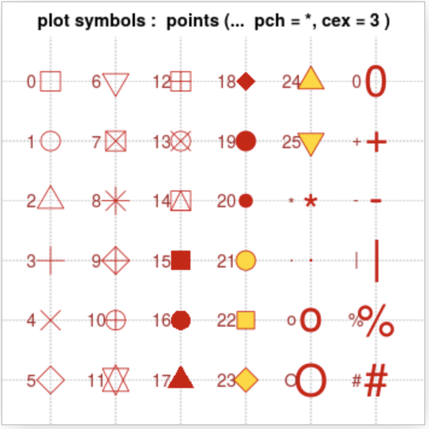
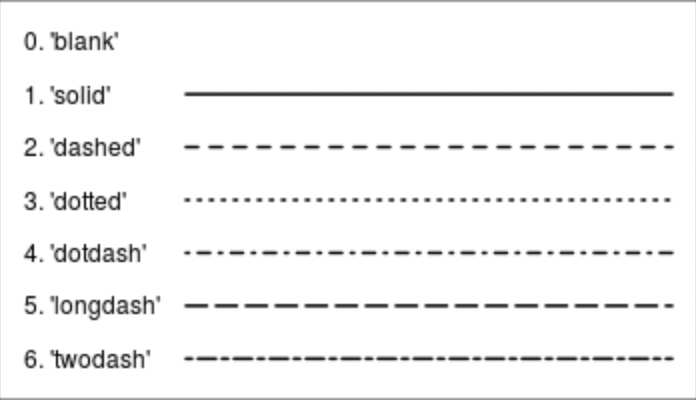

```{css, echo=FALSE}
/* Increase overall body font size */
body {
  font-size: 18px;   /* default ~16px → +2 sizes */
  line-height: 1.6;
}

/* Headings */
h1 {
  color: #F28E7B;
  font-weight: 700;
  font-size: 2.4em;
}

h2 {
  color: #88B99B;
  font-weight: 600;
  font-size: 2.0em;
}

h3 {
  color: #D18C74;
  font-weight: 500;
  font-size: 1.6em;
}

h1, h2, h3 {
  margin-top: 1.2em;
  margin-bottom: 0.6em;
}

/* Optional: make code slightly larger for students */
pre, code {
  font-size: 0.95em;
}


```

# Introduction to R: Week 1

> Welcome to the R component of **PY1617 Employability: Foundations of R for Statistics and Data Science**

This notebook brings together all material for the R component of the module, spanning ten weeks of teaching.

In this first week, the focus is on **orientation**: understanding what R is, why we are using it, how it fits into data science and statistics and getting everything set up correctly on your computer.

---

## Overview of the R Component

This component runs across **ten teaching weeks**, starting from the very basics of using R and progressing to writing functions and simulating data by the end of the term.

Teaching is shared across the module:

  1) **Weeks 1–5** are taught by Dr Abigail Page and focus on foundational R skills, data handling, and visualisation
  2) **Weeks 7–10** are taught by Dr James Winters and focus on programming concepts and simulation

By the end of the component, you will be able to use R confidently as a tool for working with data in academic, research and workplace contexts.

---

## Aims of the Component

The R component aims to develop **foundational skills in R** that underpin data analysis, statistics and data science.

Specifically, the component aims to:
  1) Build confidence in using R and RStudio
  2) Develop good habits for writing clear, reproducible code
  3) Introduce core data workflows used in statistics and research
  4) Prepare you for later statistics modules in Years 1 and 2
  5) Develop digital and data literacy skills valued in the workplace

---

## Learning Objectives

By the end of this component, you should be able to:

  1) Use **R and RStudio** confidently, including scripts, projects and packages  
  2) Understand and work with **data types, objects and data frames** in R  
  3) Apply a **tidy data workflow** to clean, transform and reshape data  
  4) Create and label **new and recoded variables**  
  5) **Summarise and visualise data** effectively using ggplot2  
  6) Use basic **programming concepts** (loops and functions) to automate tasks  
  7) Write **clear, reproducible code** suitable for academic and workplace contexts  
  8) Use these skills to **simulate data**

---

## What Is Data Science?

Data science is the process of turning data into understanding and insight.

This typically includes:

  1) Managing data  
  2) Cleaning and preparing data  
  3) Exploring and visualising data  
  4) Modelling and interpreting results  
  5) Communicating findings clearly  

Data science is best thought of as a **workflow**, rather than a single technique.

### The data science workflow

Throughout this module, we will refer to the **data science cycle (Figure 1.1)**, which describes how data are:

  1) Imported: bringing data into R   
  2) Prepared and transformed: cleaning the data so you can do what you want with it.   
  3) Explored and visualised: explore patterns and trends   
  4) Modelled: apply statistical models   
  4) Communicated: report your results clearly in plots and tables   


We can think of this as a cycle because you don't do the steps only once, but you loop back and forth. 

The first step in any data analysis is importing your data into R. This usually involves loading data from a file into a data frame. Without access to your data within R, you cannot perform any analysis.
Once your data is imported, it’s important to tidy it. Tidy data has a consistent structure where each column represents a variable and each row represents an observation and each cell represents a value (Figure 1.2). This organization makes it easier to work with the data, allowing you to focus on analysis rather than data cleanup.


After tidying, the next step is often transforming your data. Transformations can include filtering for specific observations (e.g., data from a particular participant or year), creating new variables from existing ones (e.g., calculating speed from distance and time), or computing summary statistics (e.g., counts, averages). The process of tidying and transforming data is commonly called data wrangling, because getting data into a usable form can be challenging.

With clean and well-structured data, you can begin generating insights through visualisation and modelling. These approaches complement each other:

  - Visualisation is a human-centred activity. Well-designed visualisations can reveal unexpected patterns, suggest new questions or indicate that you may need additional data. While visualisations are invaluable for understanding, they rely on human interpretation and don’t scale easily to large datasets.

  - Modelling provides a computational approach. Once your questions are clearly defined, models can answer them efficiently and at scale. However, models operate under assumptions and cannot challenge those assumptions on their own. They are powerful, but inherently limited in their ability to surprise. 
  
Finally, communication is essential. The insights you derive from analysis - whether through visualisations, models or summaries — are only useful if you can clearly explain them to others.

Throughout the process, programming supports every step. While you don’t need to be a programming expert, stronger programming skills allow you to automate tasks, work more efficiently and tackle new problems more effectively.
These tools cover most of what you’ll need in a data science project. 

This R component focuses primarily on the **foundational stages of this cycle: importing, tidying and visualising data**. These are the skills that everything else depends on.
Data modelling and communication will be focused on in other components and modules. 

---

## What Is R?

R is a programming language designed specifically for **data analysis, statistics and graphics**.  
It was first developed in 1996 and is now widely used in academia, research and industry.

R is:

  - A command-driven language
  - Highly flexible and extensible
  - Widely used for statistical analysis and data visualisation

You may have encountered other statistical software such as SPSS, Stata, or MATLAB. R differs from these in that it is:

  - Script-based rather than menu-driven (you write things rather than click things)
  - Highly customisable
  - Open source and free to use

---

## What Is RStudio?

RStudio is the software environment we will use to work with R.

You can think of:

  - R as the engine which does the work   
  - RStudio as the dashboard which makes it easy to do the work   

RStudio provides:

  - A script editor
  - A console for running code
  - Tools for viewing data, plots and files
  - Integrated help and documentation

Once we have installed RStudio we no longer need to directly access R! 

### Why we use R & RStudio

R & RStudio is widely used because:

  - Faster & more accurate than hand calculations: Computers handle repetitive statistical tasks easily. Doing a few calculations by hand helps you understand concepts, but mostly it’s about intuition.
  - Better than spreadsheets: Excel and similar tools feel familiar but are limited for serious analysis. R is far more flexible and powerful.
  - Free & open source: No expensive licenses, no student-version traps—R is professional-level software at no cost.
  - Highly extensible: Thousands of additional packages are freely available, letting you use cutting-edge methods and advanced techniques as you grow.
  - Learn programming along the way: Using R teaches programming skills, which are essential for modern research, online experiments, automated data collection, AI, and computational methods.
  - Widely used in research: Learning R gives you access to standard tools in statistics and psychology, putting you closer to advanced, real-world methods.

Bottom line: R can be challenging at first, but its power, flexibility, and relevance make it the best choice for serious data analysis.

---

## Challenges of Learning R

Learning R can feel challenging at first, especially if you do not have a programming background.

Common difficulties include:

  - A steep initial learning curve
  - Small errors in code causing unexpected problems (e.g. a missing closing bracket or misplaced comma can be frustrating)
  - Not knowing how to phrase questions when searching for help

This is normal.

> **A useful rule of thumb:**  
> Knowing what to search for is a large part of working effectively in R. AI tools make this a lot easier!


Over time, you will build familiarity with common patterns and solutions.

---

## Installing R and RStudio

Before you can start using R, you need to install **both R and RStudio**.

### Installing R

1. Go to: https://cran.r-project.org  
2. Select your operating system (Windows, macOS, or Linux)  
3. Download and install the **latest version** of R  

> Always install R **before** installing RStudio.

---

### Installing RStudio

1. Go to: https://www.rstudio.com/products/rstudio/download/  
2. Download **RStudio Desktop (free version)**  
3. Install the latest version for your operating system  

Once installed, you will **open RStudio**, not R itself.  

Opening RStudio automatically starts R in the background.

Finally you will need to download Rtools from Cran: https://cran.r-project.org/bin/windows/Rtools/. 
> Make sure this is installed before moving on. 

---

## First Steps in RStudio

When you open RStudio for the first time, you will see several **panes** (also called panels). Each has a different purpose to help you work efficiently in R.

- The **console** (where code runs) on the left 
- The **environment** (where objects are stored) on the top right 
- Panels for plots, files, and help on the bottom right 

### Console
The **console** is where you **type and run R commands directly**.  We will play around with this at the end of the session. 
The console executes your commands immediately and shows the results.

### Envrionment and history 
The Environment tab shows all the objects you have loaded into R or created (variables, data frames, lists, etc).
The History tab keeps a record of all the commands you have run in the console. You can click on it and see what you have just done, and re-run it. 

### Files, plots, packages, helps and viewer 

This is were you can view lots of useful pieces of information and access your files: 

  1) Files: Lets you browse files in your project folder. You can import data from here. 
  2) Plots: Displays graphs and visualisations you create. This pops up automatically when you make a plot. 
  3) Packages: Displays which R packages are installed and loaded. What you can use to install more packages (we will get to this)
  4) Help: Shows documentation for functions you search.
  5) Viewer: Used for HTML outputs and interactive visualisations.

These tabs help you navigate your project, visualize results and find help quickly. We will come to each of these sections in turn. 

First, there is a final section of RStudio which is only viable when you open up a R Script. 

### R scripts 

An R script is a file where you can write, save and edit multiple lines of R code. Like a word document for R code! 
Scripts have the file extension .R and are saved in a folder on your computer. 

You can either open a blank script: 
  - Go to File (top left piece of paper with a green plus) 
  - New File 
  - R Script

This creates a script where you can write and save your code.

OR you can load a pre-made R script which you or someone else have made to run. You can download the pre-made R Script for Week 1 session here:  

[Download the R Script](https://brightspace.brunel.ac.uk/d2l/le/lessons/67180/topics/2028425)


---

## Basic R Expressions 

You can:

  - Type directly into the **console**, or  
  - Write code in a **script**, which can be **saved, shared and reproduced**.  

> Tip: If you write directly in the console, your work is **not saved** when RStudio closes. 

So while we will show you how to write script directly into the console today, in future we will be working with scripts. 

### Writing in the console

In R, `<-` is the **assignment operator** (not `=`).  

  - Example: `x <- 500` tells R “x equals 500.”  
  - Whenever you type `x`, R will read it as 500.  

**Steps:**

  1) In the console (after the `>`), type:  
  2) "x <- 500" 
  3) press enter 
  4) write x in the next line 
  5) press enter 

it will look like this: 

```{r}
x <- 500 

```

> **Question**: when you select "x" and press enter what is the output? 

> **Activity**: practice with different numbers and letters

In the top right corner of the console you will see a **brush** icon. If you click on it, it clears your console environment. Do this now. 

You now have a blank screen so have lost your work. If you go to the history tab now you can see your previous code, and doubling clicking it will bring it back to the Console for you to re-run! 

But because you cannot save your work in the console we recommend you always write code in an R script. 

### Writing in a script 

Lines starting with `#` are **comments**.  These are notes you leave for yourself or others to help understand what it is you have done

  - R **ignores them**, so they are not run.  
  - They can say anything you like
  - They are essential - you will thank yourself later for a well commented script! 
  
Below is what working in a script looks like.  

```{r}
# THIS IS A COMMENT! 

# To run the code below just select the lines and press 'run' above 
#(or control/command + enter). You can run line by line, or select it all at once.

x <- 10 # telling R that x now equals 10  
print (x) # printing this in the console

# so this has done the same as above, but now your work is saved here. 

y <- 10 + 20 # telling R that y now equals 10 + 20
print (y)  # printing this in the console 

z <- "hello" # telling R that z now equals "hello"
print(z) # printing this in the console

# you can also get R to print by highlighting the text and press 
# enter/run (called auto-printing) which is often easier to do!

a <- "hello"
b<- "world"
a 
b   # run all four lines at once 
```

## Working with R: Key things to know

Some final points about R’s behaviour, errors, spacing and “unfinished commands”

### R is literal
R does exactly what you tell it. It has no intuition, no autocorrect and no ability to guess your intent.
Typos matter. For example 10 = 20 gives you an error 
  
```{r}
10 - 20   # produces -10, but may not be what you meant

```
Even simple mistakes can produce wrong answers without errors. Always double-check what you type.  
    
### R ignores some spacing
Extra spacing usually doesn't matter 
  
```{r}
10 + 20
10+20    # both work fine

```
  
  - but don't split words or function names (e.g. you can't say citat ion())
  - consistent formatting is good practice 

### R can comestimes detect incomplete commands
  - If R thinks a command isn't finished, it waits for more input 
  - This also works works for long commands broken over multiple lines 
  - To cancel a command mid-typing, press escape to return to the prompt. 
  
R is a powerful tool, but it’s precise and literal. Be careful with typos, spacing, and parentheses, and remember that errors are part of learning. With practice, reading and understanding R’s responses becomes easier.

# Workflow in R: Week 2 

This week focuses on good workflow habits when working with R. These skills may feel minor now, but they are essential for reproducible analysis, collaboration and avoiding frustration later in the course.

> **Using this notebook**: In the lecture you will workthrough this notebook. You should copy the code segments below into a new R script (instructions given below) to practice and work through the exercises and questions. To *make a new script in R*: select the paper icon with a green plus on it in the top-left corner and select 'R Script' from the top of the drop-down menu. You now have a blank page in front of you. You will make a new script each week.    


## Organising folders on your computer

Before opening RStudio, it is important to think about how your files are organised on your computer. Much confusion and many errors in data analysis come from poorly organised files rather than problems with the code itself.

Some guidance on best practice: 

  - Create a main course folder (e.g. PY1617) and keep all related work inside it
  - Inside this folder, create sub-folders for different types of files, such as:
    - `data` – raw and cleaned data files
    - `scripts` – R scripts you write
    - `outputs` – plots, tables or processed data created by R
  - Use clear, informative names that describe what the file contains
  - Avoid spaces and special characters; use hyphens - or underscores _

Good organisation makes it easier to:

  - Find files quickly
  - Understand your work weeks or months later
  - Share work with others
  - Avoid breaking code that relies on file paths

> **Exercise 2.1** 
Create a folder structure for this module on your computer. 

> Call the first folder "PY1617", with sub-folders for "analysis", "methods" and "skills". In the **skills folder** include the following folders: 
  1)	Data
  2)	Scripts 
  3)	Outputs 

You will save your R project into the Skills folder later! 

## Object based computing

R is an **object-based programming language**. This means that most of what you do in R involves **creating objects** and then **doing things to those objects**. It is useful to remember that everything in R is an object.

An **object** is simply a way of storing information so that R can use it later.

### What is an object?

An object can store:

  - A single number  
  - Text (a character string, e.g. "Hello")  
  - A collection of values  (e.g. 1, 5, 7, 3)
  - An entire dataset  (rows and columns)

For example, last week we learnt how to store a single number within the 'x' object

```{r object}
# make x = 10 
x <- 10

# print x 
x
```

Here:

  - x is the object name
  - <- assigns a value
  - 10 is the value stored inside the object

Once an object is created, you can reuse it:

```{r reuse object}
# add 5 to x 
x + 5

```

R remembers what x refers to and uses its stored value to add 5 to 10 = 15 

### Why use objects?

Objects allow you to:

  - Avoid repeating the same values
  - Work with complex data (such as datasets)
  - Write clearer, more readable code
  - Build analyses step by step

For example, instead of repeatedly typing a dataset name or value, you store it once and refer to it when needed.

### Object Names

Object names should be:

  - Short but meaningful
  - Written in lowercase (as a rule you don't want to be messing around with caps in your code)
  - Use underscores rather than spaces

Examples of good names:

  - `age`
  - `survey_data`
  - `mean_score`

Examples to avoid:

  - `x1` (often the default at importing, so quickly confusing)
  - `my stuff` (too genric)
  - `FINALdata` (you will end up with finalfinalFINALdata which is confusing)

Good naming makes your code easier to understand and reduces mistakes.

### Reusing objects 

Once an object exists, it can be:
  
  - Used in calculations
  - Passed into functions
  - Combined with other objects

```{r objects in cal}
# y = x*2 
y <- x * 2 # Here, y is created multiplying the value stored in x by 2

# print y 
y
```
NB - if you don't save the output as a new object, R prints it automatically. If you save it as a new object (like y here) then you will need to ask R to print it to view and confirm. 

> Object-based thinking is central to working effectively in R: create objects, then operate on them.

### Activity 2.1: Working with objects 

This activity will help you practise creating and using **objects** in R. 

**Step 1**: Create the following objects in your script under a commented header # Activity 2.1 by copying this code into your script

```{r}
# Activity 2.1 

age <- 20
years <- 5
name <- "Alex"
score <- 68

```

> **Question 2.1**: Check that these objects appear in the Environment pane. Can you see the correct values attributed to the objects? 

**Step 2**: Create a new object using the objects you already made:   

```{r}
# add 1 to age
age_next_year <- age + 1


```

> **Question 2.2**: What is Alex's age after five years? 

**Step 3**: R allows you to overwrite objects, so update the age variable 

```{r}
# overwrite age with 25 
age <- 25

```

> **Question 2.3**: what happened to the original value of age? 

**Be careful: once an object is overwritten, the old value is lost unless you saved it elsewhere.** 

**Step 4**: make a simple single observation dataset to add to your environment. First, check that all your objects already made appear in your environment pane (name, age, years and score). Now combine these objects into a dataset with one row. The dataset is called 'student':

```{r}
# make a dataframe called 'student
student <- data.frame( # function is data.frame()
  name = name, # includes name called the same as before 
  age = age, # age 
  score = score # score 
)

# name = name means bring the 'name' variable across and call it 'name' 
# in the new dataframe. 

```

You have created a dataset with one observation! 

> **Reflection**
1) Which objects currently exist in your Environment?
2) What happens if you restart RStudio and type age again?
3) Why does this show the importance of scripts?

*NB for reflections you don't need to write anything - just think about it!*

## Understanding the R environment 

When you work in R, everything you create or load during a session lives in the R environment. **The environment is R’s internal workspace, where objects such as data files, variables are stored and easy to access**. This becomes very useful the more complicated your analysis. 

### What lives in the environment?

- Data you read in from files (e.g. CSVs)
- Variables you create (numbers, text, data frames)
- Objects created by running code in scripts or the console (like we just did) 

For example:

```{r x and y}
# make x = 10 and y = 100
x <- 10 
y <- 100 
```

Both x and y are now alongside your ‘student’ data and other objects now exist in the environment and can be used by other lines of code.

You can check what objects are in your environment with the `objects()` function 


```{r}
# check the objects in your environment 
objects()
```


You can remove objects from your environment as well as adding them. In RStudio, the easiest way to remove variables is using the Environment pane.

  - click the brush at the middle of the envionrment pane 
  - This removes all the objects in your environment, resetting it. 
  
**Deleting variables cannot be undone.** Once a variable is removed, it no longer exists in the environment.
You can also remove variables using code, which is useful if you want to be explicit in a script.You do this with the `rm()` function: 

```{r}
# remove x and y variables 
rm(x, y)

# re-check 
objects() 
```


### The Environment pane

The Environment pane shows:

  - A list of all current objects
  - Their names and basic information (e.g. size or type)

This pane helps you:

- Check whether your data has loaded correctly
- See what objects are available to use
- Avoid re creating objects unnecessarily

*If something is not in the Environment, R cannot use it.*

### Sessions and memory

  - The environment only exists while RStudio is open
  - When you close RStudio, the environment is cleared
  - This is why saving scripts is essential: scripts allow you to recreate the environment by rerunning code
  - We can also avoid this by using projects…
  
## RStudio projects 

An RStudio Project connects RStudio to a specific folder on your computer. Keeping all the files associated with a given project (input data, R scripts, analytical results and figures) together in one directory is such a and common practice that RStudio has built-in support for this via projects. 

### Why use projects?
  
  - Automatically sets the correct working directory
  - Keeps scripts, data, and outputs together
  - Makes it easier to return to your work later

### Activity 2.2: Creating a project for this component 

We are now going to make use of your folder structure you made earlier to save our R project in an easy to find location. Please follow these steps: 

  1.	Open RStudio
  2.	File → New Project 
  3.	In browse select your skills component folder you made earlier 
  4.	Call your project ‘foundations’ 
  
  *NB - R saves the project in its own folder, you can delete this and just copy and paste the 'foundations' project into your 'Skills' folder.* 


**Now, quit RStudio**. Inspect the folder associated with your project — notice the `.Rproj` file. Double-click that file to re-open the project. Notice you get back to where you left off: it’s the same working directory and command history, and all the files you were working on are still open. 

## Working directory 

Once you have made your project you will have a ‘home’ to save all your code and output. This is called the working directory is the folder R looks in straight when reading or saving files. This is like in your computer when you first go to save a word document it first suggests ‘your documents’ folder. 

Basically, now **R will default to save everything, and import everything from your project folder you just made!** This is super useful to be easily able to find your work. 

### Checking your working directory

RStudio shows your current working directory at the top of the console:


And you can print this out in R code by running `getwd()`

```{r WD}
# check working directory
getwd()

```


If you want to know the associated list of files and/or sub-directories within your working directory you can use `dir()`

```{r contents}
# check what's in your WD 
dir() 
```


## Saving scripts and naming files 

**RStudio automatically saves the contents of the script editor when you quit, and automatically reloads it when you re-open**. Nevertheless, it’s a good idea to avoid `Untitled1`,`Untitled2`, `Untitled3`, and so on and instead save your scripts and to give them informative names.

Script files are those with a `.R` file extension. These aren’t data files at all; rather, they’re used to save a collection of commands that you want R to execute later.

It might be tempting to name your files `code.R` or `myscript.R`, but you should think a bit harder before choosing a name for your file. Three important principles for file naming are as follows:

Good file names should:

  - Be machine readable: avoid spaces, punctuation, and special characters
  - Be human readable: the name should describe what the file does or contains
  - Sort in a sensible order: numbering files (e.g. 01-, 02-) helps keep work organised

For example, instead of:

  - `code.R`
  - `final.R`
  - `temp.R`

Prefer:

  - `01-load-data.R`
  - `02-exploratory-analysis.R`
  - `03-clean-data.R`

Clear file names reduce confusion and help others (and your future self) understand your workflow.

> **Exercise 2.2**: At the moment you should have a unamed script you have been using for this weeks content. Please now give it a sensible name (e.g. week2) when you save it. You can save it by pressing the disk icon in the script 
pane in the top left. This will automatically open up the interface to your working directory. 

## Reading and writing files using relative paths

Once you are working inside an RStudio Project, you should always use relative paths, not absolute paths.

*A relative path is written relative to the project’s working directory*. For example: `data/diamonds.csv`

This is telling R to access the data file (.csv) diamonds in the ‘data’ folder which is saved in your R project folder (set by your working directory).

This works on any computer, as long as the file is inside the project folder. This makes your code portable and easy to share (doesn’t have the long file directory with your user name etc. which won’t work on other computers) 

An absolute path points to a specific location on one computer, such as:

  - Windows: C:/Users/...
  - Mac/Linux: /Users/...

*You should avoid absolute paths in scripts* because no one else will have the same folder structure. This shows you why its so important to have a good folder structure at the start of any project. 

One final detail:

- Windows uses backslashes (\) in file paths
- Mac and Linux use forward slashes (/)

R can handle both, but backslashes need special treatment and can cause errors. For this reason, always use forward slashes (/) in R, even on Windows.

### Reading in datasets 

So now we know all this we can import data from our data sub-folder into R easily. Comma separated value (CSV) files are those with a `.csv` file extension. These are just regular old text files, and they can be opened with almost any software. It’s quite typical for people to store data in CSV files, precisely because they’re so simple.

We will be using CSV files in this component as a rule. 

```{r read}

# import (read) a dataframe 
mydata <- read.csv("data/mydata.csv") 

# note that if you called your folder 'Data'
# you will need to use the capitalised Data, not my 'data'. 

# you are telling r what to call the  # dataset (mydata) and you are telling R 
# where to find the data (in the data folder, called mydata.csv) 

```

We can also ask R for some specifics when we are reading in our data. These specific requests are called 'arguments' in R terminology: 

  - The argument `header` is a logical variable indicating whether variable names are included in the top of each column or not.


```{r read with header}
# read with header 
mydata <- read.csv("data/mydata.csv", header = TRUE) 

```

We inspect the data using the function `head()` which presents the first 6 rows of the dataset.

```{r}
# check the first 6 rows 
head(mydata) # it's a single variable of height 


```

### Writing data 

'Writing' data refers to when we want to export data from R on to our computer. You could otherwise call it saving, like you would in excel. The standard function in R to export data is `write.csv()`. Let's try this with a new dataset. We will now use one of the built in data-sets that R has, called 'iris'. 

R has a couple of in-built learning datasets, so we are just going to save this to your computer. We are going to use the relative path so we're sending it to the outputs folder within your working directory. This just means you know where to find it. 

```{r write}
# save iris to your 'outputs' folder 
write.csv(iris, "outputs/iris.csv") 

# here we're saying, find the file called 
# 'iris' then write it to csv. in the outputs folder within the working 
# directory. Go check this folder now to confirm. 

```

> **Exercise 2.3**: bring together all your skills now and make a dataset with the following objects 1) your name, 2) your age, 3) your fav colour and 4) your height. The save this as "mydf.csv" in your outputs folder. Then go to this folder and open it in excel. 

## Functions and Arguments

Just before we wrap up this week we are going to introduce formally a last few key things in R: functions, arguments and packages. 

R works by creating objects, applying functions to objects to make them doing specific things and controlling behaviour using arguments.

### Functions

Functions perform actions on objects. We saw this actually just above with the `read.csv()` which is the function, and the argument of `header=TRUE`. To give another example using the data we just read into R. 

```{r function}
# the mydata is just one variable - 'height' so lets compute the mean for this 

mean(mydata$height) 

# we will learn more about dataframes next week, but the 
# way I have called the object has changed slightly to mydata$height 
# this is because height is a variable within the dataset, so i'm asking R to 
# look into the object dataset [mydata] to find the object variable [height]
# but we will come back to this

```

This function here is `mean()` and it calculates the average of the values stored in x. Rather than calculating the sum of your numbers and dividing manually every time, you can use the mean function, which performs this calculation for you with a single command. This makes your work easier and more efficient. Later in the module, you’ll learn how to write your own functions to perform custom calculations automatically. 

However, here the function to compute the 'mean' hasn't worked because it has returned the result `NA`. This is because R cannot compute a mean if there are NAs in the dataset (which there is if you look at the `mydata` tab in the viewer) and you haven't told R how to handle these NAs. You need an **argument** to do this. 

### Arguments

After the functions comes the **arguments** - the content of the brackets. Arguments change how a function behaves:


```{r argument}
# add the na.rm argument 
mean(mydata$height, na.rm = TRUE) 

# na.rm means 'remove NAs' so your telling R
# just to compute the mean igroning the NAs. 

```

So here: 

  - `mydata$height` is the object
  - `mean()` is the function
  - `na.rm = TRUE` is an argument telling R how to handle missing values (telling R to remove all missing values when you are calculating the mean)
  
Understanding this pattern — **objects → functions → arguments** — is key to reading and writing R code.

## Packages

A package is basically just a big collection of functions, data sets and other R objects that are all grouped together under a common name. Some packages are already installed when you put R on your computer, but the vast majority of them of R packages are out there on the internet, waiting for you to download, install and use them.

R packages are basically add-ons to base R. Base R does a number of simple functions, but thanks to the open-source ethos behind R the R community has built a large number of packages (over 14,000 on the CRAN where you downloaded R from) to solve common problems or offer new analysis techniques. This is the reason why R is so great. A package brings new functionality in the form of data, code, documentation and tests. 

Generally, when you open up R, only a few of these packages (about 7 or 8) are actually loaded. Basically what it boils down to is this:

  - **A package must be installed before it can be loaded.**
  - **A package must be loaded before it can be used.**

### Installing packages  

**You only need to install packages once**. To so you need to use the install packages command `install.packages("tidyverse")`

This is the R command that does all the work. R then goes off to the internet, has a conversation with CRAN, downloads some stuff, and installs it on your computer. Here we are downloading the tidyverse package which has many of the functions we will be using in the coming weeks. 

### Loading packages 

Loading makes it available for use. You will need to do this every session, unless you are saving your environment. Most scripts you will see start with the required packages at the top, in addition to any required data (we will review scripts set-up in more detail next week). **It is good practice to specify which packages your project requires at the start of any script** as they are unloaded when you re-start R and chunks of code won't work if you don't re-install them (and its way too easy to forget which chunk uses which package).

```{r install}
# install tidyverse once downloaded 
library(tidyverse)
```

The tidyverse is actually a group of core packages. You can seem them listed above. We will be making use of dplyr, ggplot2 and readr in the coming weeks. 

# Data in R: Week 3

This week builds on the workflow foundations from Week 2. We will focus on **how to write good scripts** and introduce the **core data structures** used in R. These skills are central to working efficiently, reproducibly and confidently with real data.


## R Scripts in more detail 
Before working with data, it is important to develop good coding habits. These habits will save you time, reduce errors and make your work understandable to others.

We started using a script last week but this script had no formatting. You just copied and pasted code from this notebook into it. What this means is that it can be hard to come back to the document and work out what meant what, or where you left off. We have to add structure to our script, just like we have titles and headers in a word document to make it easier to understand. 

### Structuring your script from the very top

Every script you write should **start with a clear header**. This makes it immediately obvious what the file is for and when it was last worked on.

A good script header usually includes:

  - A short title describing the purpose of the script
  - Your name and any co-authors 
  - The date (or date range) of work

```{r header}
# ============================================================
# Script: week3_practice.R -----------------------------------
# Purpose: Working with scripts and data frames
# Author: Your Name
# Date: 2026-02-01
# ============================================================
```

This header does not affect how the code runs, but it is extremely valuable for organisation and reproducibility. It will always sit at the top of your script. 

### Start with packages and data

The first functional section of your script should deal with **anything that must be available before the rest of the code can run**. This usually includes:

  - R packages that need to be loaded (assuming they are installed)
  - Data files that need to be read into R

Placing these steps at the top means that:

  - Errors appear early, not halfway through your analysis
  - Anyone running your script knows exactly what they need

A typical structure looks like this:

```{r header and set up}
# ============================================================
# Script: week3_practice.R -----------------------------------
# Purpose: Working with scripts and data frames
# Author: Your Name
# Date: 2026-02-01
# ============================================================


# 1.0 Setup ------------------------------------------------------

## 1.1 Packages   ------------------------------------------------
library(tidyverse)

## 1.2 Data import ------------------------------------------------
iris_data <- iris # if working  from a pre installed dataset.   
mydata <- read.csv("data/mydata.csv") # importing from your project 

### 1.2.1 Data inspection --------------------------------------------
head(mydata)

```

Note that I have started numbering the sections, again this is just good practice for when you start having really long processing and analysis scripts to help you work out where you are. 

Every week you should now start a new R Script with this structure. 

### Using # and ## for the RStudio document outline

RStudio provides a document outline / drop-down menu (at the bottom right of the script pane) that allows you to jump between sections of a script. This becomes increasingly useful the longer your script gets. You can click on it to quickly move between different sections - kind of like a table of contents. 

RStudio recognises comment-based headers using hashes and dashes:

```{r levels}
 # creates a top-level section ---------------------------------
 ## creates a subsection ---------------------------------------
 ### creates a sub-subsection ----------------------------------
```


For main section headings you use four dashes after a single #. If you use two ## or ### they become nested subheadings underneath the main heading. 

Example:

```{r numbered levels }
# 2. Data import -----------------------------------------------------
## 2.1 Reading files -------------------------------------------------
### 2.1.1 Inspecting the data ----------------------------------------

```

These headers will appear in the RStudio drop-down menu, allowing you to quickly navigate large scripts.

> Good practice: Use top-level headers (#) sparingly for major stages of your workflow, and sub-headers (##, ###) for detail.

If you use separators without text you will get untitled in the drop-down menu which helps you navigate the script quickly. 
e.g. 

```{r separator}
# ------------------------------------------------------------
```

RStudio sees this as a section with no name, so it shows up as “<untitled>”.

### Activity 3.1: Create a new R script for this weeks material and structure it as follows (copying the code section above for the first three sections):

  - A header with title and date with 1) set up for packages and data 
  - Add in the following structure: 
    - 2) Data types 
    - 3) Vectors 
    - 4) Data frames 
    - 5) re-labelling variables 
    - 6) Pipes 

> We will populate this structure with sub-headings as we work through the rest of the workbook. As will last week, copy the code chunks into the script. Eg here: 


Finally make sure you save it to a the 'scripts' folder in your R project, with a sensible name (e.g. Week 3). 

## Data types

In R, every object has a type (also called its class). The type determines what kind of values the object can store and what operations make sense.

### Common data types in R

The most frequently used data types are:

  - Character: text values, e.g. names or labels: "a", "hello"
  - Numeric: real numbers with decimals: 2.1, pi
  - Integer: whole numbers: 1, 2, 3 etc. 
  - Logical: TRUE or FALSE values
  - Factor: categorical variables with fixed levels

let's make some now: 
```{r make objects}

# Make the four objects of different types 
char_example <- "statistics" 
num_example <- 3.14 
int_example <- 10
log_example <- TRUE
```

Now we can check what data type each of these objects are by using the ‘class’ function which calls the objects we just made in the brackets: 

```{r check class}
# check the class of objects 
class(char_example) 
class(num_example) 
class(int_example) # telling you it’s a numeric value, which is wrong! 
class(log_example) 
```

Although numeric and integer values often behave similarly, they are stored differently in memory. Factors will be discussed in more detail later once we have covered vectors, as they are especially important for statistical modelling.

> **Exercise 3.1**: create four variables of the correct types for the following variable names: name <- “Alex”, score <- “72.65”, age <- 30 and passed <- TRUE 

> **Exercise 3.2**: using the class() fuction to check the data type. Are any wrong ? Comment in your script using # if any are wrong.    

### Coercion between types

You can coerce values into different types. R automatically reads an integer (whole number) as numeric (as we saw above!). So you have to tell it. You can either add an L at the end or change it’s class: 

```{r, coerce to interger}
# Using L
int_example1 <- 10L
class(int_example1) # r now knows this is a integer

# Forcing int_example by changing the class 
int_example2  <- as.integer(int_example)
class(int_example2) 

# note that I have used the object assignment operator here. 
# If I didn’t R wouldn’t save your changes 

#  coerce it back to numeric
int_example  <- as.numeric(int_example) 
# check the class 
class(int_example) 
```

You can do the same with factors with as.factor (but we’re coming back to this)

> **Exercise 3.3**: use as.integer() function to coerce “age” into an integer and save the result. Re-check it using class(). 
 
## Vectors

Vectors are the fundamental data structure in R. A vector stores multiple values of the same type in a single object. For instance, a numeric vector comprises of a list of numbers (e.g. `[1, 2, 6, 6, 3, 6, 2]` is a vector of integers) . In this section we will examine various ways to construct and subset a numeric vector. 

### Creating vectors

The simplest way to create a vector is with the `c()` (combine) function.

```{r vectors}

# make 2 vectors 
vec1 <- c(1, 2, 3, 4, 5) 
vec2 <- c(6, 7, 8, 9, 10)

# print the vectors
vec1 
vec2 

```

Two vectors can also be joined into the same vector using the `c()` command. The two smaller vectors will appear in the new one in the order you specify:

```{r combine vec}
# Combine vectors
vec3 <- c(vec1, vec2)
vec3 
```
> NB - this is different to ADDING vectors, as we will see below! 

### Vectors are ordered

Vectors are ordered, meaning the position of each element matters. The first element is position 1, the second is position 2, and so on. When you reference a vector by position, you get exactly the element in that position.

```{r ordered}
# make the vector and print 
my_vector <- c(10, 20, 30, 40) 
my_vector

```
The second element in this vector is the number 20, the third is 30. This will always be the case unless you force a change. 

Ordering also matters for calculations and operations. For example, if you add two vectors together, R adds them element-wise based on their positions:

```{r adding vectors }
# make two vectors 
v1 <- c(1, 2, 3)
v2 <- c(10, 20, 30)

# add the vectors together 
v1 + v2 

```


Changing the order of elements changes the results of any operation that relies on position - like adding.

```{r reversing vector}
# reverse the order of the vector 
rev_v1 <- rev(v1) 
# now saved under a new object name (rev_v1) 

# add rev_v1 AND V2 together  again 
rev_v1 + v2 

# how different is the result? 
```

> Key takeaway: Always be aware of the order of elements in a vector. Many mistakes in data analysis happen when positions are assumed incorrectly.

> **Exercise 3.4**: Create a vector of 5 numbers representing scores of five different assessments (0-100). Please give them five unique numbers.  

### Indexing vectors
Square brackets `[]` are used to extract elements from vectors. This is how we can check the ordering. 

If we want to extract the nth (e.g. 5th) element of a vector, specify n within the square brackets:

```{r indexing}
# make a vector 
my_vector <- c(12, 16, 1, 9, 0) 

# find out the 5th element in this vector
my_vector[5] 
```

This feature can be extended to extract multiple elements from a vector. For instance if we wanted to select the first and second elements of the vector "my.vector", we would do so in the following way:

```{r multi index}
# extract elements 1 to 2 
my_vector[1:2]
```

> **Excerise 3.5**: Use indexing to the score of your third assessment. Then reverse the vector and check which position this is in.  

### Removing values 
We are also able to remove the nth element from a vector, we can do so using the '-' command within the square brackets.

```{r removing values}
# remove element 2 from the vector 
my_vector[-2]

# remove elements 1 to 2 from the vector 
my_vector[-c(1:2)]

```
Remember, however than you will need to re-save the vector (ideally with a different object name to avoiding overwriting). 
```{r renaming vectors}

# print the vector again 
my_vector # does it still include the 2nd element? 

# remove the second element and assign it to a new object 'my_vector2' 
My_vector2 <- my_vector[-2]  # what about now? 

# print to confirm 
My_vector2
```

### Text vectors and factors

Vectors can be also made up of `strings` (i.e. words) instead of numbers. We simply have to enclose the characters/strings by quotation marks like in the following example:

```{r text vector}

# make a vector based on text and print 
country <- c("Japan", "USA", "France")
country

```
Factors are the last variable type in R, otherwise known as categorical, nominal or ordinal variables. These are variables which are groupings with no clear order (e.g. apple, banana, orange - two apples are not the same as one orange), or if ordinal then groupings with an order but you don't know the size of the space between the levels (e.g. 1st, 2nd and 3rd in a race. You know that the 1st person is quicker, but you don't know by how much). 

```{r text vector to factor}
# make a vector of characters 
blood <- c("A", "B", "O", "AB", "A", "B", "O", "O", "AB", "B") 

# print  
blood 

# check class 
class(blood)  
```

In the first line we made a string list the blood type of 10 observations. This doesn't necessarily make a factor, however. A factor must have levels (e.g. the groups - A, B, AB, O) specified to 'lump' together these observations (e.g. 2 observations of A, 3 obervations of 0 and 2 observations of AB) 

So, we force the vector of characters to be factor using the function `as.factor`. By doing this that R recognises that blood is made up of a limited (4) number of possible values (A, AB, B and 0) which become the levels. when you print `blood` now it tells you the observations in the first line, and the number of levels in the second.  

```{r as factor}
# Froce blood to be a factor 
blood <- as.factor(blood)

# print 
blood
```

You can also ask R to just tell you the levels using the function `levels()` and the number of levels using `nlevels()`

```{r check levels}
# check levels 
levels(blood)
## [1] "A" "AB" "B" "O"

# count number of levels 
nlevels(blood)
```

Factors can also be comprised of numbers. Sometimes, in data entry, rather than write 'man', 'woman' or 'non-binary' researchers will code these observations to '1', '2' and '3'. Some people just prefer this in data process and analysis. In this case, you just need to tell R that these numbers need to be handled as a factor. 

### Activity 3.2: Making a factor 

To make a `gender` factor please do the following steps: 

 - Make a new object called `gender` based on a vector of 15 integers 
 - The observations should be a combination of 1 for men, 2 for women and 3 for non-binary. You can pick the distribution of numbers (e.g. 1, 1, 1, 1, 2, 2, 2, 2, 3, 3, 3..... etc....)
 - Check it's class. Is it numeric or character? 
 - Force it to be a factor. 
 - Check it's class again. What is it now? 
 - How many levels does it have? 
 - What happens to the `gender` variable now if you try to add 2 to it (e.g. gender + 2) - why? 

Factors are very useful things, and we’ll use them a lot in this module: they’re the main way to represent a nominal scale variable so you have to make sure you are handelling them correctly in R. 

### Ordered factors 

If you are working with an ordinal variable (e.g. educational level or class, in which some levels are greater than others) you will need to tell R their order because it will not necessarily know. You have to tell R in the argument of the function that it is ordered using `ordered = TRUE` 

```{r ordered factor}
educ <- c("Prim", "Ter", "Sec", "Sec", "Ter", "Prim")
educ <- factor(educ, ordered=TRUE)
educ
```

In fact, with strings, R orders them automatically alphabetically. This worked for the above example between Primary education is before secondary etc. But what this means it that it will assume that A-levels (for instance) is 'before' GSCE, while we know this is not the case. In this case, you need to tell R which comes first. This requires one more argument in your code: 

```{r changing order}
# Example vector of education levels
edu <- c("UNIVERSITY", "GCSE", "POSTGRAD", "ALEVEL", "GCSE", "UNIVERSITY", "ALEVEL")

# Convert to ordered factor with the desired order in the argument 
edu_ordered <- factor(edu,
            levels = c("GCSE", "ALEVEL", "UNIVERSITY", "POSTGRAD"),
                            ordered = TRUE)

# Check the result
edu_ordered
```


## Data frames
 
So far, we have made lists of single variables (e.g. gender or education). However, when working with real data, we usually have multiple variables measured on multiple observations. In R, **this is a data frame**, which stores this information in a rectangular structure. 

This is the main format of data you will be working with and we already covered how to import it last week [i.e. mydata <- read.csv("data/mydata.csv")]. 

This week we will discuss how to explore an imported data frame, how to change the name of variables, and how to sub-set a data frame. 

### Exploring a data frame 

Before any data analysis, it is good to know the details about the dataset you are using, e.g. number of variables, sample size, etc.

To start learning about dataframes we are going to use a simple dataframe - Fisher's Iris flower dataset. The data set consists of 50 samples from each of three species of Iris (*Iris setosa, Iris virginica and Iris versicolor*). Four features were measured from each sample: the length and the width of the sepals and petals, in centimetres.

```{r head }
# Look at the top of the dataset
head(iris)

```

```{r exploring df}

# what are the names of the columns 
names(iris) 

# how many columns are there?  
ncol(iris) # e.g. variables 

# how many rows are there 

nrow(iris) # e.g. observations 

```

All these functions allow you to quickly understand the size and structure of the dataset.

> **Question 3.1**: How many observations does the iris dataset contain? How many variables? 

To look at individual columns or variables you can use the `$` sign. The object before the `$` is the data frame (e.g. `iris`) and the object after is the variable name in the dataset (e.g. `Sepal.Length`) 

```{r variable names}

# view Sepal.length in iris df 
iris$Sepal.Length
```

So we can use some of the functions we learnt earlier like `class()` in the context of the data frame on a specific variable

```{r class of variables}

# check the class of variables in a data frame 
class(iris$Sepal.Length)
class(iris$Species)

```

### Exploring with comparison operators 

We can also subset by condition (e.g. greater than, equal to, less than). But before we do this **we need to know about comparison operators**.

In R, we often want to compare values in our data. R provides several comparison operators that return TRUE or FALSE depending on whether a condition is met. Here are the main ones:

| Operator | Meaning                     | Example                  |
|----------|-----------------------------|--------------------------|
| `<`      | Less than                   | `5 < 10` returns `TRUE`  |
| `>`      | Greater than                | `5 > 10` returns `FALSE` |
| `<=`     | Less than or equal to       | `5 <= 5` returns `TRUE`  |
| `>=`     | Greater than or equal to    | `5 >= 10` returns `FALSE`|
| `==`     | Equal to                    | `5 == 5` returns `TRUE`  |
| `!=`     | Not equal to                | `5 != 5` returns `FALSE` |

> In R, the command `!` always indicates logical negation: i.e. the opposite (!= 5 means show me everything that isn’t 5 in the dataset). 

In R, you can apply these comparisons to vectors or columns in a data frame. This is like asking questions from the data, which will give you logical responses (TRUE/FALSE). For example, using the iris dataset:

```{r comparison operators}
# Which Sepal.Length values are less than 5?
iris$Sepal.Length < 5

# Which Sepal.Width values are greater than or equal to 3.5?
iris$Sepal.Width >= 3.5

# Check if Species is equal to "versicolor"
iris$Species == "versicolor"

```

Each of these commands returns a logical vector (TRUE or FALSE) for each row.

## Re-labelling variables 

Clear and consistent variable names make your code easier to read and prevent errors. R is case-sensitive, which means `Sepal.Length` is different from `sepal.length`. A common approach is to use all lowercase letters and replace dots or spaces with underscores.

> I find it simpler never to use caps in R then I never need to wonder if anything isn't working because I did, or didn't use caps. 

The dplyr package provides a convenient `rename()` function we are going to use

```{r renaming}
# load the dplyr package 
library(dplyr)

# Rename Sepal.Length to sepal_len
Iris2 <- iris %>%
  rename(sepal_len = Sepal.Length)

# Check the result
names(Iris2)

```

You can see the first variable has now been renamed. We can do this with all the variables when we hate caps. 

```{r remove caps}

# remove caps from all variables 
Iris2<- iris %>%
  rename(
    sepal_length = Sepal.Length,
    sepal_width  = Sepal.Width,
    petal_length = Petal.Length,
    petal_width  = Petal.Width,
    species      = Species
  )

names(Iris2) 

```

NB – dplyr has a nice function where it will automatically remove the caps on all variables! Let's use this to save typing

```{r auto remove caps}
# Convert all column names in iris to lowercase
Iris2 <- iris %>%
  rename_with(tolower)

# Check the result
names(Iris2) 

#NB*2 – you can also do this for annoying dots with underscores. You can do this with gsub() inside rename_with()

Iris2 <- iris %>%
  rename_with(~ gsub("\\.", "_", .))

# Check the result
names(Iris2) 


```

## Introducing pipes

In the above code you will notice we introduced the `%>%` character for the first time. **This is called a pipe**. 

The pipe operator `%>%`, from the `dplyr` package, passes the output of one step directly into the next step. Think of it as saying:

“Take this, and then do that next.” *all in one code line* 

It allows us to write sequences of operations in a readable, left-to-right way.

  - **Readable**: You can read it top-to-bottom, like a list of instructions.
  - **No temporary variables needed**: No need to create iris_subset first.
  - **Easy to extend**: You can add more steps at the end without changing the earlier code.

We will learn more about pipes next week and in future weeks as we start using them more! 

#  Data Manipulation in R: Week 4

This week we move from organising data to actively manipulating it. Real datasets are rarely ready for analysis: variables need to be recoded, summaries created, formats changed and missing data handled.

## Overview: Why do we need data manipulation?

In an ideal world, every dataset would arrive perfectly organised, with clear variable names, no missing values, and exactly the structure needed for analysis. In reality, this almost never happens.
Data manipulation refers to all the steps we take to reshape, clean and transform raw data into a form that can actually answer our research questions. It sits between importing data and analysing data.

### Raw data are rarely analysis-ready

Real datasets often contain problems such as:
  
  -	Variables stored in the wrong format (e.g. numbers saved as text)
  - Several measurements spread across multiple columns
  - Categories with confusing labels (e.g. `1 = male`, `2 = female`, `3 = other`)
  - Missing values coded as `-99` or blank cells
  - Five response categories where two have only one participant (small sample sizes because there are too many categories)
  - Separate files for different time points or conditions

Before we can run even a simple analysis, like calculating a mean or making a plot, these issues must be resolved.

### What counts as “manipulation”?

Typical manipulation tasks include:
  
  -	Creating new variables from existing ones
  - Recoding categories into clearer labels
  - Combining several items into a scale score
  - Reshaping data from wide to long format
  - Handling missing values correctly
  - Producing summaries by group

> These steps do not change the meaning of the data - they make the data usable.

### Manipulation is part of thinking

Data manipulation is not just technical work; it is part of the research process. For example:

  - Deciding to combine “very satisfied” and “satisfied” into one group reflects a theoretical judgement about what distinctions matter.
  - Choosing to average three height measures assumes they represent the same underlying construct.
  - Collapsing a 5-level variable into 3 levels may be necessary because small groups would make statistical results unreliable.

Good manipulation therefore requires both coding skills and research reasoning.

### From workflow to analysis

This week we move to a more powerful approach using the `tidyverse` (an extra package in R we installed before), which allows us to express manipulation steps in a clear, readable sequence.
By the end of this week you should be able to:

  - Use core tidyverse 'verbs' (`mutate, group_by, summarise, select, filter`)
  - Convert data between wide and long formats
  - Recode variables and create new ones
  - Set reference levels for factors
  - Rename variables consistently
  - Round numbers appropriately
  - Handle missing values (`NA`) safely

## What is tidy data?

A dataset is tidy when:

  - Each row = one observation
  - Each column = one variable
  - Each cell = one value

Example of tidy structure:

| id | height | weight | gender |
|----|--------|--------|--------|
| 1  | 172    | 68     | F      |
| 2  | 181    | 75     | M      |

Untidy data mixes measurements across columns or repeats variables across rows.

## What is clean data

Even tidy data may not be clean. Clean data usually means:

  - Correct variable types (numeric / factor / character)
  - Informative factor labels
  - Sensible categories (no tiny groups of n=1)
  - Missing data handled explicitly

## The tidyverse: transforming variables and datasets

The tidyverse is not a single package but a collection of packages designed to work together for data science in R. The core idea is that data analysis should be:

  - readable like plain language
  - consistent across different tasks
  - based on tidy, well-structured data
  - easy to combine into step-by-step workflows

Instead of learning dozens of unrelated functions with different rules, the tidyverse gives you a unified grammar for working with data frames. Most of what we do—cleaning data, creating variables, calculating summaries—can be expressed using a small set of verbs that behave in predictable ways.

We installed it last week, but make sure its loaded: 

```{r}
library(tidyverse)
```

### What packages are inside the tidyverse?

When you run: library(tidyverse) R actually loads several packages: 

| Package  | Main purpose                         |
|----------|--------------------------------------|
| dplyr    | Data manipulation (Verbs)            |              
| ggplot2  | Data visualisation                   |
| readr    | Importing data                       |
| tidyr    | Reshaping data (wide - long)         |
| tibble   | Modern version of data frames        |
| stringr  | Working with text                    |
| forcats  | Working with factors                 |

For now we will be working with the dplyr, ggplot2 and tidyr packages. 

### Thinking in “verbs”
The tidyverse provides a set of functions (often called verbs) designed specifically for working with data frames. Each verb does one clear job, and verbs can be combined using pipes to create readable workflows.

The most important verbs are:

| Verb          | What it does         | Everyday meaning           |
|---------------|----------------------|----------------------------|
| `select()`    | Choose columns       | “Keep these variables”     |
| `filter()`    | Choose rows          | “Keep these observations”  |
| `arrange()`   | Reorder rows         | “Sort the data”            |
| `mutate()`    | Create new variables | “Add or transform columns” |
| `summarise()` | Calculate summaries  | “Reduce to statistics”     |
| `group_by()`  | Work within groups   | “Do this per category”     |

We talked about pipes a bit last week, but going to re-cap now as fundamental in tidyverse. It means:

> Take the thing on the left and use it as the first argument of the function on the right.

 The pipe lets us write data analysis the same way across different functions/verbs. 

Together these verbs allow you to express almost any data manipulation in plain, logical steps. Today we will be covering all but arrange(). 

So, for today we will practice some tidyverse verbs on a simulated  dataframe about student scores.  Please download the dataframe from week 4 Brightspace material. 

```{r set up}
# import the dataset from Brightspace 
df <- read.csv("data/tidyversedf.csv")

# check it
names(df)
nrow(df)
ncol(df)

```

> **Remember**: make sure the df is saved in your data folder. Remember, to change the code if your ‘data’ folder is called ‘**D**ata’. 

This dataset is of 200 observations of 17 variables collected from students. Each student has a unique `student_id`. The students are allocated to three groups (A = psychology, B = anthropology and C = sociology in the `group` variable). There final mark on their stats exam is in the `mark` column. The proportion of sessions attended is in the `attendance` column. Their gender is stored under `gender_code`. Their height was measured three times to reduce measurement error and captured in variables `h1, h2 and h3`. There we asked a 5-point Likert scale on how satified they were with the teaching on the module (variable `lik1`) and finally answered 7 questions of the GAD-7 psychometric scale to estimate their anxiety prior to the exam. The 7 questions for GAD-7 are stored under `gad1 to gad7` variables.

We will do a number of transformations to this dataset now using tidyverse verbs

### `filter()` – choosing rows in a dataset 

One of the most common tasks in data analysis is to focus only on the observations you care about but reducing down the dataset. You might want to:

  - look only at students from one tutorial group
  - analyse only people who passed the exam
  - remove participants with very low attendance
  - focus on data from one year, one country, or one condition

`filter()` keeps rows that meet a logical condition and discards the rest. SO you can read:

`filter(mark >= 40)`

as: “Keep only the rows where mark is greater than or equal to 40.”

This is very different from `select()`, which chooses columns. Let's give this a go now:  

```{r filter on mark }
df %>% # pipe so = take the df (on the left of the %>%) and 
  filter(mark >= 40) # do a filter by mark equal to or higher than 40
```

This returns only students who achieved at least 40 which is n = 195. Remember, in R does not save the changes you made as a new object (or overwrite the existing one) unless you tell it to. For now, the original `df` is unchanged, R just printed the changes. You can check this by checking the number of observsations in the `df`. 

```{r nrow}
# check number of rows (observations)

nrow(df) # should be n = 195
```

So we need to save it as a new object. As a rule you should be overwriting your df, but making a new one 

```{r saving subset}
passed_students <- df %>%
  filter(mark >= 40)

nrow(passed_students)
```

You now have a new dataset containing only those 195 students who passed.

#### Using more than one condition

Most real analyses require multiple rules at once. Now you need to use the AND (`&`) condition which means BOTH things must be TRUE for the observation to be selected. 

```{r filter AND }

# filter on group A AND mark more than or equal to 60 
df %>%
  filter(group == "A" & mark >= 60)

```
 > **Question 4.1**: what is the number of rows now in the df? 
 
You can also use the OR (`|`) when either or can be TRUE 

```{r filter OR}
# filter on mark OR attendance 
df %>%
  filter(mark >= 70 | attendance >= 90)
```

So this keeps students who either had a high mark (70 or above), or had high attendance, or both. 

**Key take-aways for `filter()`**

  - `filter()` works on rows (observations)
  - you have to tell it to save a new data frame
  - Conditions must evaluate to `TRUE/FALSE`
  - You can combine rules with `&` and `|`
  
### `select()` – choosing columns

While `filter()` chooses rows (observations), the verb `select()` chooses columns (variables). This is useful when:

  - your dataset has many variables but you only need a few
  - you want to simplify a table before analysis
  - you want to create a cleaner dataset for sharing

> You can think of `select()` = “keep these variables, drop the rest”

#### Keeping columns 

Using our student dataset if we want to just cut it down to three columns/variables (id, group and mark) we can type; 

```{r select col}

# select id, group and mark 
df %>%
  select(student_id, group, mark)

# This returns a new data frame containing only those three columns.
# To save it as a new df: 

df_small <- df %>%
  select(student_id, group, mark) 

# check the top 6 lines of the new smaller df 
head(df_small)

```

#### Removing columns

Removing columns is just as easy with `select()` - you just use the minus sign: 

```{r}

# to keeps everything except attendance.
df2 <- df %>%
  select(-attendance)

# view the new df 
head(df2)

# You can drop several variable just add to the list using
# the vector function you learnt last week (c())

# drop attendance and mark
df3 <- df %>%
  select(-c(attendance, mark))

# view the new df 
head(df3)

```

Whether you select columns to keep or remove just depends the number you want to remove from the original data frame. If you want to keep lots then use 'remove', only a few, then use 'keep' - just saves on your typing. 

### `mutate()` – creating and recoding variables

In psychology we almost never analyse raw variables exactly as they were entered. We usually need to:

  - add items together to create scale scores
  - convert raw measurements into meaningful indicators
  - recode numeric codes into labels people can understand
  - collapse small groups to avoid unstable statistics

The tidyverse verb `mutate()` is the main tool for doing all of this - it creates new columns or change existing ones.

> You can think of `mutate()` = “add a new variable based on what is already there”

Rather than editing the raw data in Excel, we create new variables inside R so the process is reproducible. We will now go through some key examples you will need to use in psychology.

#### `mutate()` to % or logical TRUE/FALSE

Psychologists often need to create relative scores (%) from absolute numbers as well as create indicator variables:

  - clinical cut-offs
  - high vs low groups  
  - passed vs failed

Let’s practice this now with our student dataset.   

```{r make % and pass}

# in the original df make two new variables 
df %>%
  mutate(
    mark_percent = mark / 100, # mark as a % 
    passed = mark >= 40 # TRUE/FALSE if passed 
  )

# has it saved? 
head(df)
```

This creates two new columns:

  - mark_percent – the original mark divided by 100-
  - passed – `TRUE/FALSE` depending on the mark being above 40 (pass) or not (Fail). 

> **Question 4.2** - what do you need to do to save these new variables in the df? Do this now. 

> **Question 4.3** - How do you check the class of the two new variables you made? What are they? 

#### Creating Psychometric Scale Scores

Most questionnaires measure constructs (e.g., anxiety, depression and well-being) using multiple items, like the GAD-7. We normally need to combine (sum) these into a single score. We can also do this with `mutate()`

This will be highly useful because psychological constructs are rarely measured by one question


```{r sum mutate}

# compute total GAD7 score from several items
df <- df %>%
  mutate(total = gad1 + gad2 + gad3 + gad4 + gad5 + gad6 + gad7)

# note as we're just adding new variables we don't need to give the df a new name 

# check df variable names
names(df)

# NB – if you want to type less you can tell row to sum between gad1-gad7 
df <- df %>%
  mutate(total = rowSums(across(gad1:gad7)))

# check df variable names
names(df)

```

> **Question 4.4** - is `total` the best name for this new variable? Why not? 

What this code does: 

  - Adds a new variable called total
  - For each participant it adds their responses to items gad1-7
  - The original item variables stay unchanged

> Tip: it's always useful to reduce typing where you can because the more you type the more errors can sneak in. gad1:gad7 is better than gad1, gad2, gad3.... 

 
#### Mean of repeated measures

Sometimes we have several measurements of the same thing (e.g., height measured 3 times, reaction time across trials). It is unlikely you will want to run three statistical models (and even if you did, how would you reconcile different results?) so we will want to reduce these 3 measures into a single observation. 

One way of during this is computing the average of the three scores, which we can also do with mutuate

```{r mutate mean}

# compute mean of h1, h2 and h3 
df <- df %>%
  mutate(mean_height = (h1 + h2 + h3) / 3) # new variable is called mean_height

# check the df 
names(df)

```

NB – obviously like we learnt in previous weeks we will fit an issue if there are NAs in the dataset and in this code we haven't told R how to handle these NAs so it will come up with an error. So we can use this slightly fancier instead 

```{r mutate mean NA }
# compute mean of height removing NAs 
df <- df %>%
  mutate(mean_height = rowMeans(across(h1:h3), na.rm = TRUE))

# check the df 
names(df)
```

This one handles the NA (tells R to remove them) and also computes the mean across h1 to h3 without typing all of them out (which is important if you’re computing the mean across a bunch of variables).  

#### Recoding numbers into meaningful labels

Datasets often contain numeric codes rather than words

  -	`1` = man, `2` = women
  -	`0` = control, `1` = intervention1, `2` = intervention2 
  -	`1-5` Likert scales rather than "strongly agree" etc 

Numbers are convenient for computers but terrible for humans reading output. It can make it much harder to interpret your results with this, and you may forget your coding scheme later on, making it hard to reproduce your work. So we can use mutate to convert numeric codes into words. 

```{r mutuate gender}

# make a new variable gender based on the old gender_code 
df <- df %>%
  mutate(
    gender = case_when(
      gender_code == 1 ~ "man", # if gender_Code 1 then make it man 
      gender_code == 2 ~ "woman", # if gender_Code 2 then make it woman 
      gender_code == 3 ~ "non-binary", # if gender_Code 3 then make it non-binary 
      TRUE ~ NA_character_
    )
  )
```

To break this longer code down: 

  - `case_when()`, each line is: `condition ~ value_if_condition_is_true` then make it either man, woman or non-binary. 
  - The final line:  `TRUE ~ NA`: “For all remaining cases that didn’t match any rule above → assign `NA`
  
####  Collapsing Small Categories

Sometimes, once you have collected your data you see that in a factor, some levels have very small sample sizes. For instance, imagine this variable:

| Education | n  |
|-----------|----|
| GCSE      | 4  |
| A-level   | 5  |
| UG        | 82 |
| PG        | 91 |


Running statistics with tiny groups (n=4, n=5) is unstable, violates assumptions and is hard to interpret. The solution to this is to collapse categories (e.g. GCSE and A-level can be combined to a single level)

We can do this in the practice df by combining levels in the Likert scale. Likert scales are often scored 1-5, representing 1 strong disagree, 2 = disagree, 3 neither agree or disagree, 4 = agree and 5 = strongly agree. 

But five levels is a lot ot handle, and you may have low repsonses in 1 (strongly disagree) and 5 (strongly agree) so what we want to do is:

  1)	Combine 1 and 2 to = `disagree` 
  2)	Combine 4 and 5 to = `agree` 
  3)	Keep 3 as = `neither` 

So 5 levels has become 3, which is much easier to handle and can improve statistical power: 

```{r combine levels}

# make a new variable 
df <- df %>%
  mutate(
    likred = case_when( 
      lik1 %in% c(1, 2) ~ "disagree", # saying 1 & 2 is disagree
      lik1 %in% c(4, 5) ~ "agree", # saying 4 & 5 is agree 
      lik1 == "3" ~ "neither" # 3 = neither 
    )
  )

# check new variable levels
levels(df$likred) 

# recode as a factor 
df$likred <- as.factor(df$likred)

# re check levels 
levels(df$likred) 

```

So what happened here was that R did not automatically make this new variable into a factor with levels. So we had to force it to change the type which we learnt in week 3. 

#### Rounding numbers

One last important transformation you might want to do to your data is round the numbers to a specific number of decimal points. 

This is useful because lots of decimal points can be hard to digest and also gives a false sense of precision. We often round numbers to 2 decimal points and p-values to 3. 

With mutate we can just do this with: 

```{r mutate round}
# look at mark
df$mark

# re-save mark with 2 decimal points 
df <- df %>%
  mutate(mark = round(mark, 2)) # round is the function, mark the variable 
# and 2 the number of decimal points 

# chech the variable 
df$mark
```


So to summarise the key ideas about mutate: 

  - `mutate()` always keeps the same number of rows
  - it is used for creating or transforming variables
  - calculations are done row-by-row
  - the original data remain untouched unless you save the result

### `summarise()` – summarising data 

While mutate adds information to every row, `summarise()` reduces many rows into a single value.

> So we can understand `summarise(`)` = “turn data into summary statistics”

This is how we calculate:

  - means
  - totals
  - counts
  - minimums / maximums
  - standard deviations

```{r sum mark}
#Basic example of key summaries 
df %>%
  summarise( # opening bracket 
    mean_mark = mean(mark), # 1st line 
    max_mark  = max(mark), # 2nd line 
    n_students = n() # last line 
  ) # closing bracket 

```

The result is one row containing the summary statistics. This has a bunch of real-life uses:

  - reporting average test scores
  - counting participants per condition
  - describing datasets for methods sections
  - checking data quality (missing values, ranges)

As above, this hasn't saved this information. So you would have to keep re-running it. If you wanted to save it and - highly recommended - save this table to your computer files to use in your report/dissertation then you will need to: 

```{r sum attendance}

# calling the new object 'meansum' or the summary of mean 
meansum <- df %>%
  summarise(
    mean_att = mean(attendance), # mean of mark 
    max_att  = max(attendance), # max of mark 
    min_att  = min(attendance), # max of mark 
    sd_att  = sd(attendance) # max of mark 
  )

# Note - to add more lines I just added a , and then started a new line. 
# the last line has no c, and then has the closing bracket 

# view the saved table 
print(meansum)

# save it to your outputs folder 

write.csv(meansum, "outputs/meansum.csv") 

# again if you have **Out**puts remember to change the code to captalise the folder name. 

```

So now you have summarised one of your variables, saved this as a new object which you can save to your computer as a table for use in communicating your results! 

**Common summary functions include:**

  - mean(mark)      # average
  - median(mark)    # middle value when ordered smallest to largest 
  - sd(mark)        # standard deviation
  - min(mark)       # lowest
  - max(mark)       # highest
  - n()             # number of rows

> **Question 4.4**: commute all of these summary statistics on the transformed variable you made earlier `mean_height` and save to your outputs folder. 


### `group_by()` - doing things within groups 

On its own, `summarise()` gives one answer for the whole dataset. Usually we want answers per group (e.g. psychology versus anthropology versus sociology students). This is what `group_by()` does.

> so `group_by()` is = “do the next step separately for each category”

So we can re-compute the mean, but now by student group (A, B and C) which is another variable in our dataset: 

```{r sum by group}

# make a new table for the average and sample size for each group

meanbygroup <- df %>%
  group_by(group) %>%
  summarise(
    mean_mark = mean(mark),
    median_mark = median(mark),
    n = n()
  )

# view the saved table 
print(meanbygroup)

# save it to your outputs folder 

write.csv(meanbygroup, "outputs/meanbygroup.csv") 
```

Now we get one row per group (A, B & C) instead of one row overall. So: 
  - `group_by(group)` splits the data into invisible mini-datasets
  - `summarise()` runs inside each mini-dataset just like before
  - the results are combined back together


> **Question 4.5**: which group has the highest mean mark? Which group has the largest sample size?

You can also group by two (or more) groups if you want: 

```{r group by 2}

# compute mean, SD and n for group&gender 
grogendersum <- df %>%
  group_by(group, gender) %>%
  summarise(
    mean_mark = mean(mark),
    sd_mark = sd(mark),
    n = n()
            )

# view the saved table 
print(grogendersum)

# save it to your outputs folder 

write.csv(grogendersum, "outputs/grogendersum.csv") 

```

This calculates means for every possible combination of group and gender (e.g. a man in psychology, or a non-binary individual in sociology)! 

**Common mistakes with summarise** 

  - Expecting summarise to keep all rows → it always collapses the data.
  - Forgetting group_by before summarise → you get one overall mean instead of per group.
  - Using mutate when you really want summarise → mutate repeats values instead of reducing them
  
### Activity 4.1: using tidyverse verbs 

This activity will bring together a bunch of the verbs you just learnt about still using the `df` dataset. Specifically we're going to explore anxiety (the GAD-7 sum, labelled `total`) by degree (variable = `group`) and exam grade (variable = `mark`). Please follow these steps to answer the following questions: 

  - **Step 1**: using `select()` select only the relevant variables (`total`, `group` & `mark`). Call the new dataframe `anxietydf`
  - **Step 2**: relabel the variables as follows using `rename` (we did this last week in section 3.5)  
    - Change name of `group` -> `degree` 
    - Relabel the levels A, B and C of `degree` to psychology, anthropology and sociology, respectively, using `mutate()` 
    - Change name of `total` -> `GAD7`
  - **Step 3**: Using `mutate()` Convert GAD7 into a factor called `anxiety` with two levels based on scores < 10 -> "FALSE" and >= 10 -> "TRUE" 
  - **Step 4**: Using `group_by()` and `summarise()` compute the mean exam mark (`mark`) by BOTH variables `anxiety` and `degree` 
  
> **Question 4.6**: Which combination of degree and anxiety has the lowest score in the dataset?  

## Wide and long data

Real research data rarely arrive in the “perfect” format for analysis. The same information can be organised in at least two fundamentally different ways:

  1) **Wide format** – one row per participant, repeated measures stored in multiple columns
  2) **Long format** – one row per observation, with a variable that tells you which condition or time point it belongs to. 

Neither format is “right” or “wrong”. They simply serve different purposes. You will need to work out what format your need your data in deepening on your purpose! 

### Wide data 

In *wide data* each person appears in ONLY one row, and each observation or data point collected on them has a seperate column. For instance, if you were measuring anxiety at three separate time points in the same participant it would like this: 

| id | anxiety_t1 | anxiety_t2 | anxiety_t3 |
|----|------------|------------|------------|
| 1  | 12         | 10         | 8          |
| 2  | 15         | 14         | 13         |

It's called wide data because as you collect more and more data on a participant you can imagine the dataset getting wider and wider as more columns are filled up! 

This format is: 

  - easy for us to read as people 
  - similar to how online surveys (Like Qualtrics) kick out data when you have asked participants a bunch of questions 
  - convenient for commuting summary statistics (e.g. mean anxiety score)

### Long data 

In long data, each measurement will get its own row, so participants will be spread across many rows - making your data very long: 

| id | time | anxiety |
|----|------|---------|
| 1  | t1   | 12      |
| 1  | t2   | 10      |
| 1  | t3   | 8       |
| 2  | t1   | 15      |
| 2  | t2   | 14      |
| 2  | t3   | 13      |

This structure is harder for us to read but is often expected in repeated measures models. For within-subject designs, where the same participant is measured more than once (paired t-test, repeated-measures ANOVA and linear mixed models) the analysis needs to kmnow 1) which row belongs to the same person and 2) which condition/time each score represents. This only is clear in the long format. 

What this means is that when you have wide data, you might need to **pivot** it to a long format. 

### Converting wide to long with `pivot_longer()` 

Imagine we collected three height measurements per student as they grow over time: 

```{r wide df}

# make a wide dataframe:  

df_wide <- data.frame(
  id = 1:3, # 1 participants 
  h1 = c(154, 159, 167), # first height for each participant  
  h2 = c(165, 162, 179), # second height for each participant
  h3 = c(171, 163, 181)  # third height for each participant
)

# view the dataframe 
df_wide

```

So to make it long we need to pivot the table so you have one column which is `id`, one column as `height` and a new column which is `time` which is when each of these height measures are taken. 

```{r pivot longer}

# pivot df longer 

df_long <- df_wide %>% # renames df based on the df_wide 
  pivot_longer(
    cols = c(h1, h2, h3), # these are the columns to reduce to one 
    names_to = "time", # this takes the names of the original columns into 
    # the new variable `time`  
    values_to = "height" # the values of h1-h3 are in the new variable 'height
  )

# view the new dataset
df_long

```

Now we have:
  
  - one column saying which height measure
  - one column containing the actual values

> **Question 4.6**: how many rows did the df_wide have? How many rows does the df_long have? 

### Pivoting long to wide with `pivot_wider()` 

Sometimes we need to do the opposite and change it from long format to wide. We can change the new df_long back to df_wide if we like: 

```{r long df to wide}

# pivot wider 
df_wide2 <- df_long %>% # rename the df df_wide2 not to overwrite 
  pivot_wider( # function 
    names_from = time, # the variables labelled from 'time' column 
    values_from = height # values from the height column 
  )

# view df to confirm 
df_wide2


```

Now it is back to where it was originally. Something like this would be useful if your, like we did above, computing a total GAD-7 score from gad1-gad7. 

### Activity 4.2: pivoting the tidyverse df

Going back to the dataframe we were using for the tidyverse verbs, you will remember we had three variables measuring height. To pivot this from wide to long, follow these steps: 

  1) **Step 1**: use `pivot_wider()` on `df` and rename to `dflong` 
  2) **Step 2**: Name columns “measurement” in `names_to` 
  3) **Step 3**: Pull the values of height into the `heights` column with `values_to` 
  4) **Step 4**: View the new dataset and answer the following questions 
  
> **Question 4.7**: how many rows does this new long dataset have? 

> **Question 4.8**: for the other variables (e.g. total, gender) how are they now recorded for each paritcipant? 

  5) **Step 5**: convert this back to from long to wide again and check it matches the original structure. 
  

Key take-aways: 

  - Wide = one row per person
  - Long = one row per observation
  - Repeated measures almost always require long
  - `pivot_longer()` and `pivot_wider()` let you move flexibly between them
  - Analyes might require you to switch format depending on task


## Missing data (NAs)

In real research, datasets are almost never complete. Participants skip questions, equipment fails, files get corrupted or someone withdraws from a study. These gaps are called missing data, and in R they are stored as the special value: `NA`

Missing data matter because:

  - many statistical functions will not run if `NAs` are present
  - means and correlations can be biased if NAs are recorded as `0`
  - sample sizes may differ across variables
  - different handling choices can change conclusions

So part of data cleaning is deciding how to treat missing values in a transparent and principled way.

### Where do missing data come from?

In psychology, common reasons include:
  
  - Participant behaviour
    - skipped sensitive questions
    - survey fatigue near the end
    - “prefer not to say”
  - Study design
    - participants only complete one condition
    - branching logic in surveys
  - Technical issues
    - recording equipment fails
    - online form not saved
    - data entry mistakes
    
Understanding why data are missing helps decide what to do with them.

### Missing values in R 

R uses the special symbol `NA` (Not Available). It is not the same as:
  
  - `0`
  - an empty cell
  - the text `"NA"`
  
Let's practice this: 

```{r cal with na }
#calculation with NA return NA while 0 act normally:  

# 5 add NA 
5 + NA 

# 5 add 0 
5 + 0 

# R won't calculate a mean with an NA as we know 
mean(c(1, 2, NA, 4))

# but it will with a 0 
mean(c(1, 2, 0, 4))

```
This is R protecting you from accidentally ignoring missingness. If it didn't tell you 'NA' you wouldn't know some data was missing. 

So the first thing we have to do is check for missing data

### Finding missing data in a dataframe

There are a few ways of checking for missingness in your dataset. For this activity we going to swap to a new dataset with NAs in it. Please download the NAdf data frame from Brightspace week 4 and save in your data folder (again remembering about capitalisation of Data versus data)

  1. **Check the whole dataset**

```{r is.na}
# read new df 
NAdf <- read.csv("data/NAdf.csv") 

# ask R 'is there any NAs' in the df object? 
is.na(NAdf)

```

This returns TRUE/FALSE for every cell. As our data frame is pretty large this is hard to digest! So let's look by column. 

  2. **Count missing per variable**

```{r sum NA over col}

# Asks R to sum the number of NAs in each column in the dataset 

colSums(is.na(NAdf))

```

This is more useful, we can see there are no missing values in ID, but between 3-4 in other variables. But of course we don't know how many relative to the total these represent, so we can also ask R to give us the proprotion of missingness for each variable: 

  3. **Proportion missing**

```{r % of NA}
# Compute the proportion of missinging values for each column in the dataset 

colMeans(is.na(NAdf))

```

So we can see that missingness is highest in the `mark` column with 20%, and lowest in `gad6 and gad7` with 10%. 

Finally, we can ask R to compute summary statistics for us on the entire dataset (this is a good one to know when you first explore your data as brings lots of functions together)

  4. **Quick overview**
  
```{r summary na}

# produce summary stats for the entire df 
summary(NAdf)

# you can also do this variable by variable in the df using the $ 

summary(NAdf$mark)

```

This function automatically produces the min, quartiles, median, mean, max and count of NAs (if present) for all variables in the dataset. It also handles mean() without having to use the argument na.rm like we did before. 

### Removing missing data

There are a couple of methods of handling missingness. 

#### Option A – ignore `NAs` inside a function

Most tidyverse functions have: `na.rm` = TRUE = “remove NAs before calculating” which we used before to compute the mean. 

```{r na.rm}

# compute the mean ignoring the NAs 
mean(NAdf$mark, na.rm = TRUE)

```

This means you do not need to change the data at all, which is often preferred. 
 
#### Option B – remove rows with any NA

During data cleaning you can tell R to delete *ALL* rows with NAs in them. This is called **listwise deletion**. 

```{r drop na}

# delete all rows with NA 
df_clean <- NAdf %>% # make a new re-named df 
  drop_na() # function is drop_na 

# NB this is a case when it's really important to not overwrite your data! 

# check it's length now (number of rows) compared to before 

nrow(NAdf)
nrow(df_clean)

```

So, because we are deleting the ENTIRE row *when there is at least one NA* we have gone down from 20 observations (rows) to 3! This is a massive loss of data which is an issue. Especially if the missingless is systematic (e.g. a specific type of participant was more likely not to respond to a question). This can cause bias in your data. 

### Option C – remove NAs only for specific variables

It may be the case that you don't mind about NAs in all variables. Some variables aren't used in analysis for instance, so it would be silly to remove the entire observation. In this case you can tell R you only want to delete observations with NAs in specific variables (like mark and attendance)

```{r drop na by col}

# re-make the clean df with NA removed from 2 variables 
df_clean <- NAdf %>%
  drop_na(mark, attendance)

# check it's length now (number of rows) compared to before 
nrow(df_clean)

```

The rationale behind these decisions, and when and why we would want to do them we will discuss in future more advanced statistics causes. The consequences of your decisions matter depending on how random or not the missingness is. 

You will learn more about this in statistics modules, but briefly to finish this section. 

  1) **MCAR – Missing Completely At Random**
    - totally unrelated to anything
    - e.g., random internet dropout

  2) **MAR – Missing At Random**
    - related to other variables
    - e.g., younger participants skip income

  3) **MNAR – Missing Not At Random**
    - related to the value itself
    - e.g., highly anxious people avoid anxiety items
    - More probelmatic! 

The more systematic the missingness, the more careful we must be.

### Why shouldn't we swap NAs for 0's? 

A very common mistake in data cleaning is: “I have missing values → I’ll just change them to 0 so R can run the analysis.”
This is almost always statistically wrong and conceptually dangerous.

> NA is not the same as 0!

  - NA means “we do not know the value.”
  - 0 means “the value is genuinely zero.”

These are completely different statements! 

For example, take our GAD-7 scores in the NAdf. If we have two people, person A skipped the question because they were rushing and it was accidental, the other person didn't answer it because they had high anxiety. As a person collecting this data, you don't know the 'true situation' so NA correctly represents the situation as 'unknown'. If you re-code both to 0 you would risk making them both 'no anxiety' when this is only true of one participant, not both.  


| Person | True situation                    | What NA means | What 0 would mean          |
|--------|-----------------------------------|---------------|----------------------------|
| A      | Didn’t answer item due to rushing | Unknown       | “Perfect mental health”    |
| B      | Skipped question due to anxiety   | Unknown       | “Perfect mental health”    |

> By converting NA → 0 you are inventing extremely positive scores that were never observed.

#### 0 bias means down, NAs don't

Imagine you have 3 scores, and one missing value. If handled correctly the mean is: 

```{r mean with na}
# Imagine 3 real scores and one missing
scores <- c(12, 14, 16, NA)

mean(scores, na.rm = TRUE)

```

but if you changed that last value to a 0 then it becomes a completely different value, and tells a very different story about the sample.

```{r mean with 0}
mean(c(12, 14, 16, 0))

```

This actually happens in science and leads big papers being retracted. For those interested have a look at [Beheim et al. (2021) Nature article](https://www.nature.com/articles/s41586-021-03655-4). This is research on big gods and social complexity. 

The original dataset contained many missing observations for if small scale societies believed in big gods or not. The analysis didn't handle them correctly, coding them as 0 - big gods were absent - rather than NAs. This artifically: 

  - inflated the numbers of societies with 'no big gods' 
  - strengthened the relationship between religion and social complexity but incorrectly. 
  
When the authors re-anaylsed the data treating NAs correctly the original published findings no longer held and the paper was retracted! 

> So don't change NAs to 0! 


# Data Visualisation in R: Week 5
## Plotting with ggplot2

There are a number of packages to make graphs but ggplot2 is the most versatile and widely used. Let's make sure its installed and loaded. 

```{r install ggplot2}
library(ggplot2)
```

### Exploration of the Iris dataset 

We are interested in understanding the **relationship between Sepal length and Petal length - are they correlated? Is this a negative or positive correlation?** 

The best way to look at this is in a scatterplot with all the data points plotted by sepal length (on the x axis, bottom) and by petal length (on the y axis, left)

```{r scatter}
# Scatterplot using ggplot 

ggplot(data = iris) + # the + means R is waiting for more info 
  geom_point(mapping = aes(x = Sepal.Length, y = Petal.Length)) 
```
You have a scatterplot! 

In the above code `ggplot()` is the function which calls the plot (specifically the coordinate system you add layers to), and the object is the iris dataframe. This is folloed by a second function `geom_point()` which calls the *dots* making the plot a scatter plot. its like saying, I want a plot, and then I want this plot to be a scatterplot. 

FYI, as we will soon find out there are tons of geom_ functions dependent on the type of plot you want to make. As were are interested in the relationship between two continuous variables a scatterplot makes sense. 

After the functions comes the *arguments* - the content of the brackets. The first argument of `ggplot()` is the dataset to use in the graph. So `ggplot(data = iris)` creates an empty graph (if you didn't add the layer you would have blank panel). You can try this: 

```{r just ggplot}
# just run the ggplot without the scatterplot layer 

ggplot(data = iris) 
```
You have nothing! 

The `gemo_point(mapping = aes())` argument defines how variables in your dataset are plotted. The mapping argument is always paired with `aes()`, and the `x` and `y` arguments of `aes()` specify which variables to map to the x (sepal.length) and y (petal length) axes. This is what is required to see something in your plot. You are basically saying: 

1: I want a plot please based on the iris data  -> `ggplot(data = iris)` 
2: I want this plot to be a scatterplot with points -> `gemo_point()`
3: I want this plot to be of sepal length (X) and petal length (y) -> `(mapping = aes(x = Sepal.Length, y = Petal.Length))`

That's it! You can change this template by change the **data, geom_function or mapping variables** to create a wide range of graphics using different data. 

You can see that ggplot2 is a lot about layering. You make a basic plot and then you add features to help you better understand it. So let's take this plot further. It looks like there is a positive relationship between sepal and petal length, *however there is a bunch of data points in the far left corner which this does hold for - why is this? how can we explore this further?* 

### Adding aesthetics 

To better visualise our data we can use aesthetics by adding a third variable to the mapping argument (the bit in the `aes()`). An aesthetic is a visual property of the objects in your plot, which includes colour, size and shape of the data points. You are able to change these elements, both globally (i.e., for all points on the graph) and per group (i.e., different colours are attributed to different plant species). 

Here we can use colour to map aesthetics in your plot to the variables in the iris dataset - let's do species to see if that helps us understand the data better. 

```{r species by colour}

# Add in a colour = Species into the argument 
ggplot(data = iris) + 
  geom_point(mapping = aes(x = Sepal.Length, y = Petal.Length, colour = Species)) 

#  note colour can be spelt both in UK and US English! 
```
The colour = `Species` argument has coloured the dots either red, green or blue depending on the species label. This is called scaling. Ggplot has also automatically given you a legend on the right-hand side to explain which species is which colour.  

Note that the text has remained the same but I have just added in the colour argument at the end of the `aes()` brackets. This is using the variable `Species` from the dataset to colour the data points depending on their species label. 

Now we can see that the linear relationship between sepal and petal length holds true for `versicolor` and `viriginica` but not for `setosa`!  The red points are flat. 

Let's now try other aesthetics like the shape type or the shape size 

```{r shape and size}

# include shape = Species and size = Species 
ggplot(data = iris) + 
  geom_point(mapping = aes(x = Sepal.Length, y = Petal.Length, 
                           color = Species, shape = Species, size = Species))

# can keep adding arguments into the aes()
```

So now we have added in size and shape arguments. Each of the different species are associated with different sizes of points and different shapes. R is giving us a warning that size is not advised for a discrete variable because it is an unordered variable. 

Basically, the issue is that bigger points makes you think some species are bigger than others. This isn't the case so it's confusing and doesn't help understanding the data - I would remove this. 

Also note that all three of these aesthetics have been included in the legend!   

So instead of changing the size we could try changing the transparency of the points using the alpha argument. 


```{r alpha}

# Add alpha = Species to the plot 

ggplot(data = iris) + 
  geom_point(mapping = aes(x = Sepal.Length, y = Petal.Length, 
                           color = Species, shape = Species, alpha = Species))
```

Now setosa points are hardly visible - not really useful. This is just to show you can change all these elements, but much is not necessarily better and plots should be easy to understand! Plots should communicate something useful about the data. Again, I would just remove this. 

You can also set the aesthetic properties of your geom manually just outside the aes(). 

For example, we can make all of the points in our plot pink, all the shapes circles or all the points larger. When you do this the global aesthetic change will overwrite anything in the mapping argument -  

```{r global changes}

# colour - all pink 
  ggplot(data = iris) + 
  geom_point(mapping = aes(x = Sepal.Length, y = Petal.Length, 
                           shape = Species), colour = "salmon") 

# shape
 ggplot(data = iris) + 
  geom_point(mapping = aes(x = Sepal.Length, y = Petal.Length, 
                           shape = Species), shape = 16)  
 # 16 = small circles. 
 # Note that this has overrode the shape = species in the mapping argument. 
 
# size  
  ggplot(data = iris) + 
  geom_point(mapping = aes(x = Sepal.Length, y = Petal.Length, 
                           shape = Species), size = 3)  
  
  # bigger number = bigger points
```
  
There is an amazing range of colours you can use in r: See [Colours in R quick reference](https://sape.inf.usi.ch/quick-reference/ggplot2/colour) for colour names (replace the "salmon" above).

R has 25 built-in shapes which are identified by numbers. Shapes change, as do their colour and fill. You can see the different colours to call in the argument here 



You can see further information here in the online version of cookbook for R. See: [Shapes and Line Types in R](http://www.cookbook-r.com/Graphs/Shapes_and_line_types/)

Because these changes to the plot are happening outside of the aes() they do not convey any information about the variable so generally less informative (but pretty!) 

### Adding layers to your plot 

From the selection of plots above I think the most useful is the first one with the colours denoted by species. Often scatter graphs come with lines to show the trends in the data. This can be done using a different *geom_function* 

`geom` are geometrical objects used to represent data and ggplot has over 40 of them. So the one you pick depends on the data type you want to represent and graph you want to make. So to add a line to a your existing scatterplot you need to use `geom_smooth()`, which is a smooth line fitted to the data.

You can see why it's called a layer, because you just keep adding `geom_` to each other as you build up your plot. 


```{r at line}
  # Add a line with 95% confidence intervals
  ggplot(data = iris) + 
    geom_point(mapping = aes(x = Sepal.Length, y = Petal.Length, 
                             color = Species)) +  # same as above AND....
    geom_smooth(mapping = aes(x = Sepal.Length, y = Petal.Length), colour = "salmon") 

# adds smoothed line between sepal and petal length which is Salmon colour 

```

So we have added a smooth line with a 95% confidence region (as R tells you above by the info icon), and using the global aesthetic made it salmon coloured. Nice. But, if we know the relationship between sepal length and petal length is dependent on the species, it is probably better to have a line for each of these species. We do this in exactly the same way as we changed the aesthetics on the points *by adding a third condition into the mapping argument*. 

```{r at lines by species}
# line for each of the species
  ggplot(data = iris) + 
    geom_point(mapping = aes(x = Sepal.Length, y = Petal.Length, 
                             color = Species)) +  # same as above AND 
    geom_smooth(mapping = aes(x = Sepal.Length, y = Petal.Length, colour = Species)) 

# line is now by species as the colour = Species is in the aes() 
```

So now you can see a smoothed fit curve for each of the species. So this shows how you can add on layers to the basic graphic and how each geom_function can be changed using the mapping function. 

It is important to note that you cannot use the same arguments for all the geom types. For instance, you can't change the line 'shape' like a data point, but you can change the linetype, and make that specific to each species. 




```{r line by species}
# line for each of the species
  ggplot(data = iris) + 
    geom_point(mapping = aes(x = Sepal.Length, y = Petal.Length, 
                             color = Species)) +  # same as above and the ADD 
    geom_smooth(mapping = aes(x = Sepal.Length, y = Petal.Length,
                              colour = Species, linetype = Species)) 

# change the linetype by species 
```

This feature doesn't add much to our current plot because we changed the colour, but very useful if the plot was black and white as we have solid and dashed lines. 

Finally, you can change the line types between a smooth curve or a regression line, and whether it has 95% CI or not. 

```{r}
# linear regression lines with 95% CI
  ggplot(data = iris) + 
    geom_point(mapping = aes(x = Sepal.Length, y = Petal.Length, 
                             color = Species)) + 
    geom_smooth(mapping = aes(x = Sepal.Length, y = Petal.Length, 
                              colour = Species), method =lm) 

# add linear regression line with the argument method=lm 
#  95% confidence intervals are included as default
```

We can now see each speices has its own colour and three regression (line of best fit) lines which is included in the legend. 

We can also turn off the 95% CI if we want (but normnally we want them)

```{r remove SE}
# linear regression lines without 95% CI
  ggplot(data = iris) + 
    geom_point(mapping = aes(x = Sepal.Length, y = Petal.Length, 
                             color = Species)) +  
    geom_smooth(mapping = aes(x = Sepal.Length, y = Petal.Length, 
                              colour = Species), method =lm, se=FALSE) 

# SE=FLASE removes the 95% CI 
```


### Streamlining your code 

Our code is working well, we can see the trends for the three species clearly. However, it's a bit long winded - more space to go wrong, especially if we add in more layers. 

For instance, if you want to change the x and y variable you need to do this in both lines of code. 

It is always good to make your code as efficient as possible. We don't need to repeat the mapping for both geom_functions if we state it in the ggplot() function, ggplot2 then treats these mappings as global mappings and applies it to both geom in the graph. 

This saves use from repeating 


```{r global mappings}
# move the x and y to the ggplot function 
ggplot(data = iris, mapping = aes(x = Sepal.Length, y = Petal.Length)) + 
  geom_point() + 
  geom_smooth()
```

If you place mappings in a geom function, ggplot2 will treat them as local mappings for the layer. It will use these mappings to extend or overwrite the global mappings for that layer only. This makes it possible to display different aesthetics in different layers. This means that you don't have the use the same aesthetics for all the gemo functions.

```{r}
ggplot(data = iris, mapping = aes(x = Sepal.Length, y = Petal.Length)) + 
  # global mapping is now up here
  geom_point(mapping = aes(colour = Species, shape = Species)) +  
  # local mappings to the points 
  geom_smooth(mapping = aes(colour = Species, linetype = Species)) 
  # local mappings to the line 
```

### Facetting your plots 

The last element we will talk about now to add to your plot are facets because they are really useful and not complex to do. They are just another layer to add to the plot if you have categorical variable. Facets basically makes sub-plots that each display one subset of your data. 

The first argument of `facet_wrap()` should be a formula, which you create with ~ followed by a discrete variable name. 

```{r facet wrap}

# facet wrap by species 
ggplot(data = iris, mapping = aes(x = Sepal.Length, y = Petal.Length)) + 
  geom_point(mapping = aes(colour = Species, shape = Species)) + 
  geom_smooth(mapping = aes(colour = Species)) +
   facet_wrap(~ Species, nrow = 1) # nrow is how many rows you want. 
```

Now that it is faceted the species legend isn't really helpful. So let's remove it. 

```{r remove legend}
ggplot(data = iris, mapping = aes(x = Sepal.Length, y = Petal.Length)) + 
  geom_point(mapping = aes(colour = Species, shape = Species), show.legend = FALSE) + 
  geom_smooth(mapping = aes(colour = Species), show.legend = FALSE) + 
  # note you need to remove from all mappings
   facet_wrap(~ Species, nrow = 1) 
```

### Changing axis ticks 

Looking at the plot I would say it's a bit annoying that the ticks on the y axis (the numbers) are only every 2, I think they should be every 1 for consistency with the y.

To do this we just add another layer with the + 

```{r change ticks}
ggplot(data = iris, mapping = aes(x = Sepal.Length, y = Petal.Length)) + 
  geom_point(mapping = aes(colour = Species, shape = Species), show.legend = FALSE) + 
  geom_smooth(mapping = aes(colour = Species), show.legend = FALSE) + 
   facet_wrap(~ Species, nrow = 1)  + 
    coord_cartesian(ylim=c(1, 7)) + # this zooms into the space between 1-7 
     scale_y_continuous(breaks=seq(1, 7, 1))  # Ticks from 1-7, every 1

```

### Text on plots 

Finally, I think it would be nice if we didn't have the . between Sepal and length and Petal and length. So we need to change the text on the axes. 

Again you just need to add the ylab (label for the y axis) and xlab (label for the x axis) functions to the existing plot. 

```{r change labels}

# Change the axis labels 
ggplot(data = iris, mapping = aes(x = Sepal.Length, y = Petal.Length)) + 
  geom_point(mapping = aes(colour = Species, shape = Species), show.legend = FALSE) + 
  geom_smooth(mapping = aes(colour = Species), show.legend = FALSE) + 
   facet_wrap(~ Species, nrow = 1)  + 
    coord_cartesian(ylim=c(1, 7)) + 
     scale_y_continuous(breaks=seq(1, 7, 1)) + 
      ylab("Petal Length (cm)") +  # rename the y axis 
        xlab("Sepal Length (cm)") # rename the x axis 
```

I'm pretty happy with this! This is how we build graphs - we start simple and then build in elements to best visualise the data. 

### Exercises 5.1:  

> **A)** Plot the relationship between sepal length and petal length (as above) but this time map petal width on to colour. How do the aesthetics behaviour differently for a continuous variable (like width)? Write a one sentence summary of the plot.

> **B)** What is wrong with this code? Why are the points not blue?

```{r}
ggplot(data = iris) + 
  geom_point(mapping = aes(x = Sepal.Length, y = Petal.Length, color = "blue"))
```

> **C)** Make a scatterplot between Petal.Length and Species. Does this still look like a Scatterplot. Try geom_boxplot. 

> **D)** Make a scatter plot between sepal and petal width. Add in aesthetics to better visualise the data. Write a one sentence summary of the plot.  


#### Problem shooting 

It is really common to run a line of code and it doesn't work. Normally it is a misplaced character, or an unclosed bracket. Check that every ( has a ) and every " has a ".  

Captials also matter in R - note that Sepal.Length will work but sepal.length will not! 

Sometimes you will run the code and nothing happens. Check the left-hand of your console: if its a +, it means that R doesn’t think you have typed a complete expression and its waiting for you to finish it. In this case, its usually easy to start from scratch again by pressing ESCAPE to abort processing the current command.

One common problem when creating ggplot2 graphics is to put the + in the wrong place: it has to come at the end of the line, not the start. 

If you’re still stuck, try the help. You can get help about any R function by running ?function_name in the console, or selecting the function name and pressing F1 in RStudio. Don’t worry if the help doesn’t seem that helpful - instead skip down to the examples and look for code that matches what you’re trying to do.

If that doesn’t help, carefully read the error message. Sometimes the answer will be buried there! But when you’re new to R, the answer might be in the error message but you don’t yet know how to understand it. Another great tool is Google: try googling the error message, as it’s likely someone else has had the same problem, and has gotten help online.

#### Further resources for plotting 

See: [Cheatsheet for ggplot2](https://www.rstudio.com/resources/cheatsheets/)

See: [Cookbook for R Graphics ](http://www.cookbook-r.com/Graphs/)


# Conditional Programming: Week 6 
## Logical values
## if and else statements

# Pipes and Loops: Week 7
## Pipes (%>%)
## for loops
## Repeating operations

# Writing Functions from scratch: Week 8
## Why write functions?
## Function structure
## Writing your first function

# Simulating Data: Week 9 
## Why simulate data?
## Generating random data
## A simple simulation example

